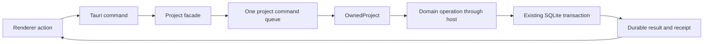

# Current source architecture

This is the ownership map for `arch-module`. Product behavior is defined by
[PRODUCT.md](../PRODUCT.md) and the [ADRs](README.md); executed qualification
is recorded in [implementation status](IMPLEMENTATION_STATUS.md). The
[modular-decomposition document](V3_ARCHITECTURE_MODULAR.md) is the historical
proposal and migration record, with baseline measurements and some unimplemented
targets. It is not a description of every current guarantee.

The follow-on design and acceptance checks are in
[strengthen-domain-ownership](../openspec/changes/strengthen-domain-ownership/design.md).

## Rust packages

Layer numbers express dependency order. A production dependency must point to
a strictly lower layer. Siblings cannot depend on each other. Normal, build,
optional, aliased and target-specific edges are checked through Cargo metadata;
development dependencies are deliberately outside this production rule.

| Layer | Package | Owns |
| --- | --- | --- |
| L0 | `wns-kernel` | Shared error, identity and record vocabulary; `SourceEpoch`; canonicalization, hashes and restricted snapshot validation |
| L1 | `wns-storage` | Project schema/migrations, SQLite configuration, shared document/revision/checkpoint and receipt primitives |
| L1 | `wns-providers` | Provider vocabulary, adapters, runtime/process ownership, catalogs and credentials |
| L2 | `wns-documents` | Scope validation, document history/restore, view-state and approved-material mutation primitives |
| L3 | `wns-context` | Eligibility, deterministic packet compilation, frozen context and packet-carried vocabulary; snapshot/guidance/conversation readers |
| L4 | `wns-story` | Story freeze and packet persistence, memory lifecycle, reviewed authority, source pins and shared run/Workshop vocabulary |
| L5 | `wns-conversation` | Discussions and run queries, lookup lifecycle, project conversation, proposals, guidance and adoption workflows |
| L5 | `wns-workshop` | Workshop state, request/output contracts, candidates, provenance, preview and adoption |
| L6 | `wns-transfer` | Backup validation, new-project recovery, duplicate/export and V2 archive inspection/installation |
| L7 | `wns-library` | Separate library database, app preferences and project installation workflows |

`webnovel-core` owns the project actor, access/lease lifecycle, host
implementations and compatibility facades. `webnovel-desktop` is the Tauri
composition layer. `wns-architecture`, `wns-bindings` and `contracts` are
verification/generation packages, not domain layers. The actual package table
and enforcement live in [architecture](../crates/architecture/src/lib.rs).

The context **compiler** is deterministic over supplied frozen input. The entire
context **crate** is not database-free: frozen guidance and conversation readers
use a caller-supplied connection. Kernel has no internal package dependencies,
but still depends on rusqlite for its error conversion. These are current
boundaries, not claims of complete infrastructure independence.

## Actor and transaction ownership

The project, document, context, Workshop and work facades share the actor handle.
They do not introduce independent queues or writers. Core implements host traits
for its `OwnedProject`, connecting sibling concerns without a sibling Cargo edge.
The actor owns the live connection; domain operations own their existing
transaction scopes and uncertain-outcome handling.

For save and adoption, optimistic source/version validation, mutations and
receipts stay in their existing transaction. A helper taking `&Connection` can use a caller's
`&Transaction` by dereference. It must not substitute a newly opened connection
or a value cached before the transaction. An uncertain commit is reconciled
through the existing operation identity, not replayed as a new author operation.

Workshop start has an existing two-transaction boundary: the discussion run is
committed before the Workshop start receipt. Recovery finds that immutable run
by exact project/namespace/operation identity and validates the original request
before replaying it. The missing-receipt regression exercises this gap; the
query extraction does not combine those transactions or dispatch a new run.

`wns-documents::material_adoption` supplies `ApprovedMaterialWrite`, a consuming
capability for one fixed ordinary-material target on a borrowed `Transaction`.
It exposes no raw connection, SQL execution or commit method. Chat and Workshop
origins select their existing exact checkpoint reasons. The caller still
validates the preview and author access; constructing this helper is not proof
of author intent.

The capability deliberately does not own the enclosing receipt, source epoch
or relationships. Conversation and Workshop retain their domain-specific atomic
adoption workflows and transaction SQL for those projections. Manual editor
saves, document restore and Workshop anchor creation are separate mutation paths.

## Query and table responsibility

All project DDL and migrations live in `wns-storage`. The table below identifies
the domain owner of interpretation and workflows; it does not claim exclusive
SQL access for every table in the current codebase.

| Data family | Domain responsibility | Boundary |
| --- | --- | --- |
| Project identity, documents, revisions, command receipts | Actor lifecycle; storage primitives; document validation/history | Current lease/head checks and caller-owned transactions |
| Frozen sources, packets, reviewed story, memory and source pins | Story orchestration with context readers/compiler | Source epoch, policy, namespace, canonical bytes and fingerprints |
| Discussion runs/messages, delivery/lookup lifecycle, project chat | Conversation | Run selection/query operations stay with conversation |
| Workshop state/snapshots/receipts/previews | Workshop | CAS save and exact preview/adoption provenance |
| Library entries/operations/preferences | Library, in a separate database | Library lock, staged operation identity and preference revision CAS |
| Backup/export/import | Transfer consuming each domain's validator | Validate before install; recovery creates a new identity |

Workshop obtains ordered run IDs, exact operation lookup and raw
completed/delivered outputs through its host's conversation readers. Full run
display still uses the existing validated reader. Raw output selection is a
different operation: Workshop retains its existing policy of skipping unrelated
invalid candidate packets while interpreting valid output itself.

During save/adoption, the completed-output reader executes on the exact active
transaction passed through the provenance helpers. It is not prefetched through
another actor call. [The ownership guard](../crates/architecture/tests/ownership.rs)
rejects direct `discussion_runs` references in Workshop source string literals,
including macro inputs. It is an accidental-coupling guard, not a SQL sandbox
against arbitrary dynamically constructed names. Shared receipt-family queries
and other raw host access remain visible limitations.

## Frontend owners

| Owner | Private state and responsibility | Consumed boundary |
| --- | --- | --- |
| `Workspace.tsx` | Layout and display derivations | Workspace model views/actions; no runtime IPC or session mutation imports |
| `workspaceModel` | Shared operation/error/notice envelope, visual overlays/search/focus, attached feature handles and close composition | Explicit presentation and command groups |
| `documentWorkspace` | Open project, mounted document/session, tabs/mode, document intent, adoption recovery, export capture and document/project rename protocols | Read-only views, explicit actions, project-navigation capability and current-session read |
| `libraryModel` | Catalog/loading, create/import forms, project create/recover/duplicate identities and library operations | View/actions; uses document owner's replacement/return capability |
| `useAppClose` | Native close admission, cancellation and completion attempt | Current session/save/operation callbacks |
| `DocumentSession` | Live editor save, checkpoint, conflict, lease reconciliation and detach barriers | Editor-owned transaction/save API |
| Feature stores | Chat/Workshop/composer draft state, save watermark and uncertain payload | Explicit store actions and subscriptions |

The library cannot set the opened project or mounted session. Replacement goes
through the document owner: flush attached chat/Workshop, settle a pending
document create, prepare the destination under the editor's detach barrier,
then activate. Failed saves, reads or cancelled pickers retain the editor.
The destination receives the latest reconciled access rather than a captured
old writer lease. Presentation resets follow successful transitions.
A completed V2 import may activate from the library only; a late import result
must not replace a project that has since been opened.

The document owner retains pending create IDs until success or a proven
precommit refusal. Adoption uses the flushed source for recovery and rereads
current Working heads after replayed receipts. Late completions are fenced by
project/namespace/session and, where relevant, mounted-session/adoption identity.
Shared shell operation admission and the editor's lifecycle barriers complement
these identity checks; none should be removed because a callback was moved.

Workshop result insertion and edit locking use store actions. Polling output
does not advance the author draft's watermark or overwrite a dirty buffer.
Explicit flush rechecks dirtiness after joining a save drain, including the
settlement-window edit case. A lock projection must not notify subscribers
during React render.

Cross-feature imports use each feature's `index.ts`; features do not import
shell and the feature graph stays acyclic. Internal owner checks supplement
that graph. See [featureBoundary.test.ts](../apps/desktop/src/featureBoundary.test.ts).

## Generated IPC contracts

Rust wire types feed nine groups in [bindings](../crates/bindings/src/lib.rs).
Generated declarations remain the source for frontend transport types; explicit
editor narrowings and response-hash checks stay handwritten where needed.

Identical repeated declarations are allowed. Conflicting same-name declarations
or duplicate output filenames fail before writing. Drift checks compare the
exact TypeScript output inventory and bytes, not just expected files that still
exist. Regeneration removes only obsolete files with its generated marker in
the resolved output directory and refuses unexpected unowned TypeScript files.

The same generator derives command names and top-level required/optional keys
from the actual `invoke_handler(tauri::generate_handler![...])` registration and
the registered Rust signatures. The JSON manifest records source hashes and
the pinned Tauri version inputs. An independent Rust drift test regenerates
the contract; the frontend test verifies current hashes and parses production
invoke calls, including aliases and namespaces, before checking registration
and argument keys. Unresolved bridge or payload forms fail the check.

Run `cargo run -p wns-bindings` after changing a wire type, command signature,
registration or hashed source. The independent serde-attribute scan, wire tests,
drift tests, TypeScript and frontend tests must pass. Command parity covers
static names and top-level keys; nested values, dynamic undefined values,
runtime authorization and native dispatch still need their own checks.

## Invariants and enforcement

| Invariant | Current enforcement | Remaining limit |
| --- | --- | --- |
| Dependencies point down | Cargo metadata graph, package identity fixtures | Development dependencies deliberately excluded |
| Frontend ownership/imports | Public feature surfaces, parsed import graph and owner checks | Object references are not a runtime security boundary |
| Historical bytes/schema | Retained canonical hashes, reader/migration tests; schema 40 unchanged | Every future migration still requires compatibility review |
| Stale source refusal | `SourceEpoch` type plus runtime epoch/policy/namespace/head checks | Newtype alone does not prove a source remains current |
| Authoritative prose vs generated material | Distinct vocabulary, provenance/fingerprint validation and explicit adoption | Not every invalid combination is unrepresentable by type |
| Explicit author Apply | Domain preview/adoption validation, atomic receipts and a consuming material-write capability | No single universal adoption capability; raw host connections remain |
| Frontend/Tauri command parity | Parsed registration/signatures, source-hashed manifest, Rust drift and parsed renderer calls | Static names and top-level keys; unsupported forms fail rather than being inferred |
| No implicit paid generation | Explicit command/admission paths, read-only paths and regression tests | No universal author-capability token around every provider dispatch |
| Save/close/recovery | One actor, stable operation identity, lease/head checks, editor/feature flush barriers | Runtime/native qualification remains necessary |

Use the pinned [full check](TESTING.md) and relevant fresh native synthetic flows
after changing these seams. Passing local mock tests does not qualify hosted
Ubuntu, installed packaging, live providers, accessibility or author evaluation.

## Choosing the next boundary

Prefer a concrete recurring dependency problem over another crate or generic
abstraction. Typed receipt-family lookup is a candidate when recurring changes
justify it. Extend the material capability pattern to another write path only
after tracing its callers and retaining exact replay/freshness tests. Measure
change locality and rebuild cost before splitting additional
packages. Keep the single actor unless evidence demands a different concurrency
model.
