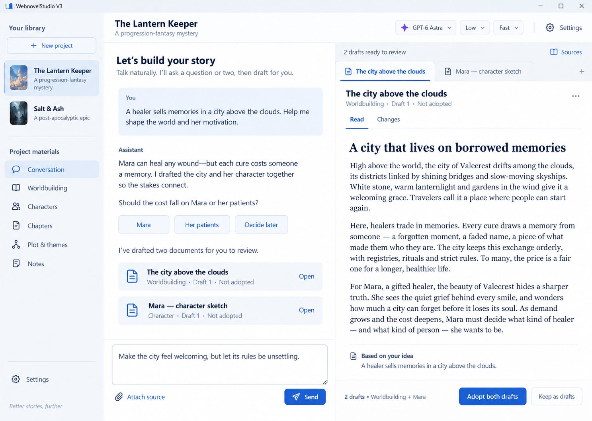
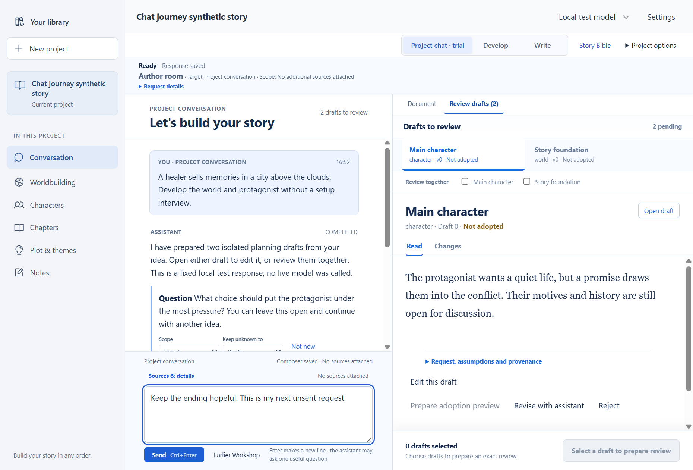
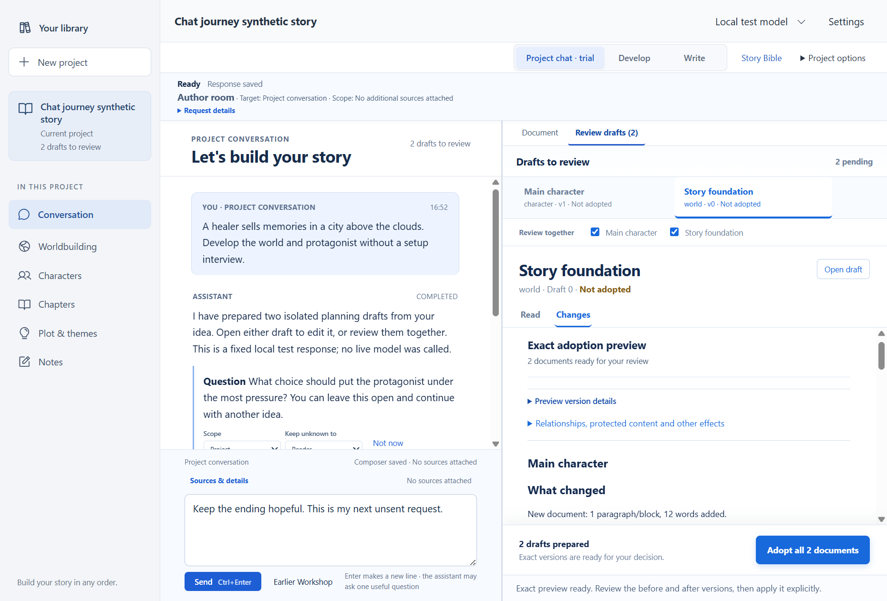

# Coauthor Desk surface

The author selected the first image concept, **Let's build your story**, on
9 September 2026. This is a visual and navigation refinement of the existing
opt-in project conversation, under the chat-first specification and ADR 0034.

## Intent

Lead with a conversation about the story. The assistant's drafts are readable
beside that conversation, so an author can discuss, inspect and refine material
without working through a technical dashboard. Story development remains free
of a required world/character/plot checklist.

The left rail contains Your library, New project, current/recent projects and
the existing material categories. These use real library records and ordinary
document counts. Fictional covers and example story metadata in the image are
not application data. The header retains the selected model and independent
reasoning/service-tier controls; provider setup remains in Settings.

The conversation uses Segoe UI and generous reading space. Draft prose uses
Georgia. White reading surfaces, slate navigation and blue selection/actions
continue the app's existing visual language. Navigation icons use pinned
Phosphor React components rather than a new custom icon system.

## Interaction boundaries

- Project and material navigation uses the existing save/detach path. Opening
  then cancelling the new-project form leaves the current workspace mounted.
- Source and provider details use disclosures. Actionable failure, stale,
  uncertainty, cancellation, scope and reconciliation state remains visible.
- Draft tabs select retained assistant drafts. Editing remains local to the
  draft; switching must flush the active draft buffer.
- Read presents the full draft. Changes exposes the exact prepared before/after
  and affected documents, including every member of a grouped operation.
- The pinned adoption action identifies the prepared version or group. A
  selected or generated draft is not accepted merely by opening it.
- Receiving a draft can populate an otherwise unused review pane; it must not
  replace an ordinary editor or redirect a narrow-screen author away from
  their composer.
- Narrow windows collapse the project rail into a navigation disclosure and
  retain one chat/document/review surface at a time. A breakpoint alone does
  not recreate an editor or send an assistant request.

## Qualification

The implemented native reading view and exact-review view use synthetic test
content and a local test model:

The native small-window capture is available
[alongside these screens](design/coauthor-desk-narrow-native.png). The current
checkpoint passed 713 frontend tests and 24 native workflow checks, including
800×600 layout and actual 200% WebView2 zoom with reachable composer and Stop.

Current executed checks and the rebuilt native application identity are
recorded in [chat-first implementation status](V3_CHAT_FIRST_UX_IMPLEMENTATION_STATUS.md).
This surface does not change the schema, provider routing, default rollout,
manuscript contracts or remaining human and installed-package qualification
gates. The concept image expresses the chosen direction; native captures
establish how the implemented surface actually renders.
