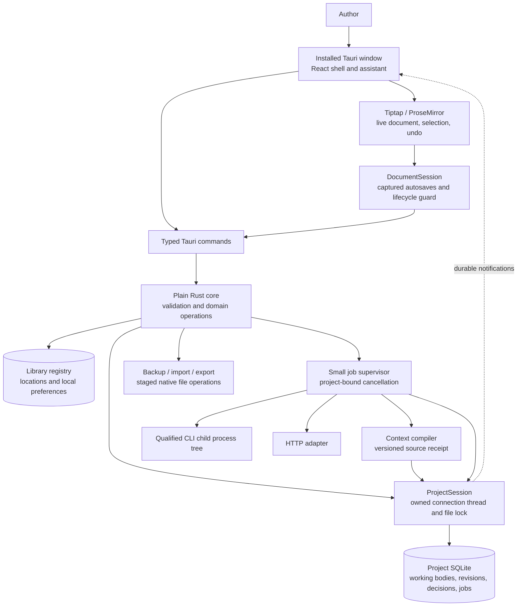

# WebnovelStudio V3 — refined desktop architecture

**Architecture decision record · 5 September 2026**

**Status:** integrated V3 design baseline with the W0 editor spike now implemented; see [W0 qualification](W0_QUALIFICATION.md) for executed evidence and remaining native trials. Durable storage, providers, and later contracts remain implementation work. This document does not modify V2 `AGENTS.md`.

**Companions:** [Delivery plan](V3_FIRST_SLICE_PLAN.md) · [Workspace plan](V3_WORKSPACE_PLAN.md) · [V2 migration evidence](V2_MIGRATION_EVIDENCE.md).
**Reading path:** §§4–8 define the editing/persistence contract; §12 exercises it; the companion orders implementation and acceptance.

**Authoring scope (user clarification):** the application, novel-writing assistance, and exports are for English novels. Wuxia, xianxia, cultivation, and translated-Chinese-webnovel terminology/register are optional English writing styles. They are not a request for Chinese-language authoring, a translation workflow, or mandatory genre stages. The Unicode document contract still preserves names, accents, and emoji exactly.

## 0. Verdict, evidence, and the important changes

**Keep the proposed desktop stack. Change the authority and recovery contracts before building the interface around it.** Tauri 2, Rust, React/TypeScript, Tiptap/ProseMirror, and SQLite are credible candidates for this application. None of them makes manuscript editing safe automatically. The product should be a writing application with an assistant, not a visible orchestration pipeline.

The most consequential decisions in this refinement are:

1. **JavaScript owns live editor transactions; Rust owns accepted durable documents.** Use schema-validated document snapshots across IPC. For suggested edits, additionally validate that everything outside an explicit edit scope is structurally unchanged. Rust does not execute serialized ProseMirror steps.
2. **Saving and applying have different reconciliation rules.** An autosave acknowledgment only advances a saved-generation watermark. Applying an accepted suggestion uses a short, local editing guard, an exact-version precondition, a durable transaction, and then a preflighted editor transaction. No save acknowledgment calls `setContent` on newer text.
3. **The working draft, historical revisions, reviewed story state, and publication records are different things.** There is one current working body per document. Other representations are immutable references, not independently editable copies of the manuscript.
4. **Start with conservative suggestion conflicts.** Any intervening body edit makes a proposal stale, even an edit elsewhere. Live selection mapping improves highlighting; it does not authorize rebasing. A lost acknowledgment cannot cause a second application.
5. **Do not gate ordinary assistance behind worldbuilding or continuity machinery.** Manual work and explicitly unreviewed drafting remain available. A separately named “Continue from reviewed story” action requires a valid reviewed basis. There is no silent fallback between those modes.
6. **Restore a backup into a recovered project, not over an open database.** This removes a disproportionately dangerous operation from the initial product while preserving recovery. Project-specific jobs and locks never refer to a mutable global “current database.”
7. **Ship a writing-and-feedback slice before an elaborate narrative engine.** No graph database, vector service, multi-agent framework, durable workflow platform, CRDT, or plugin runtime is needed to prove the requested experience.

### 0.1 What was actually available

The supplied Pro review reports that all requested files were present and readable in `CHATGPT_PRO_CONTEXT.zip`. It reports inspection of the proposal, `PRODUCT.md`, the stabilization update and historical findings in `CURRENT_STATE_REVIEW.md`, relevant sections of both research reports, the optional production kit, the repository evidence ledger, and the supplied screenshot evidence and README. The screenshots document V2; they are not V3 designs or native-editor tests. The byte-exact source is preserved at `references/pro/V3_ARCHITECTURE_REFINED.md`; its inspection claims remain historical Pro evidence, not a new execution pass by this baseline.

The archive's limitation is historical: it **did not contain the V2 application source tree, actual database/schema migrations, a representative manuscript database, or executable test fixtures**. Relative links to `src/...` in the proposal did not supply those files. The current V2 workspace supplies source, schema/migrations, tests, CI, and `AGENTS.md` for bounded design reference, but no representative actual-manuscript qualification for V3 or proof of V2 import compatibility. The Pro review reports that it did not run the reported V2 tests, launch the application, test a provider, or qualify Windows IME behavior; public dependency documentation and selected dependency source were reported as separately inspected.

The V2 stabilization update reports **169 tests in 34 files, five browser tests, and successful type/build checks**. It explicitly describes repairs to autosave, restore, source-bound settlement, cancellation, frozen-input retry, partial-output recovery, and transactional authority. Those are reported repaired contracts to preserve—not current bugs rediscovered here. The same update still reports omission of prior prose and pinned thread text from context compilation. [A3]

The repository ledger describes remote source/document inspection of ten repositories, with no installations, executed tests, generated novels, or novel-quality benchmark. Its findings can suggest designs, not establish comparative quality. Narrative-memory question answering is not evidence of full-novel writing quality. The kit's planning horizons, chapter lengths, cadence, and reserves remain optional working suggestions. [A4–A7]

### 0.2 Evidence notation

| Label | Meaning in this document |
|---|---|
| **Requirement** | Binding user request or confirmed product requirement. |
| **Attachment evidence `[A…]`** | What the supplied snapshot reports; not independently executed here. |
| **Verified technical fact `[S…]`** | Official documentation or primary source reported as inspected by the Pro review; not independently executed here. Dates/versions and limitations appear in §19. |
| **Decision** | Recommended design, including deliberately conservative behavior. It is not a claim that a library already implements it. |
| **Qualification assumption** | A behavior to establish on the locked dependency versions and supported Windows configuration before release. |

Unless expressly attributed, proposed schemas, policies, UX labels, thresholds, and algorithms below are architectural decisions. They are not benchmark results or research-derived universal rules. The `[A…]` and `[S…]` references preserve source provenance from the Pro review; they do not turn this baseline into a fresh test or provider qualification.

The user selected the separate `D:\WebnovelStudio_V3` repository. The workspace plan records the resulting layout and read-only host inventory. The delivery plan scopes A Writing, B Feedback, and C Release qualification. This architecture also defines later features; their presence here does not require enabling them in A/B. Import, batch Apply, and reviewed-story machinery remain absent until their named gates are implemented. An optional author-only review checkpoint does not imply the full ready-bundle system exists.

## 1. Decision table

| Decision | Chosen approach | Important alternative | Rationale and tradeoff | Evidence / assumption | Revisit when |
|---|---|---|---|---|---|
| Desktop host | Tauri 2; Windows-first installed application | Electron with Rust service/IPC | Retains proposed Rust host and ordinary desktop behavior without an application Node server. Uses system WebView, so runtime variation must be qualified. Electron is a credible fallback, not a parallel implementation. | Host process models [S1, S2]; editor quality unproven | A reproducible release-blocking IME/accessibility/rendering defect cannot be addressed in the supported WebView configuration. |
| UI/editor | React/TS/Vite; Tiptap 3 over an explicitly restricted PM schema | Direct ProseMirror | Tiptap conveniences are adequate; direct PM APIs remain available for precise replacements. React must not rerender the editor on every unrelated chat update. | [S3–S7]; lock exact packages in qualification | Tiptap's wrapper/extension behavior obstructs the exact transaction contract. |
| Editor/core boundary | Validated full snapshots; extra structural scope validation for proposals | General PM step replay in Rust, or a custom general patch engine | Avoids two implementations of rich-text editing. Costs snapshot serialization and a small independent validator. | PM transaction source [S6]; performance is an experiment | Measured chapter-scale serialization/save latency exceeds the qualification budget, after avoiding unnecessary rerenders/copies. |
| Applying an edit | Flush, short local lifecycle guard, Rust commit, exact JS transaction | Optimistic mutation followed by rollback/rebase | Simplest honest cross-process acknowledgment semantics. Briefly suspends document-changing input and editor disposal, never a provider-length wait. | Design; experiment E2 in companion plan | The guard is perceptibly disruptive on supported hardware, or concurrent editing becomes a real requirement. |
| Conflict policy | Exact working version and relevant context basis; no automatic rebase | Persistent mapping histories, text matching, OT/CRDT | A stale result cannot rewrite the wrong occurrence. Requires an explicit refresh after unrelated edits. | Requirement; design | Author trials show excessive refresh friction and a bounded rebase algorithm passes adversarial tests. |
| Persistence | One SQLite database per project; small independent library registry | One library-wide database | Portable projects, isolated recovery, independent jobs. Cross-project operations are staged file operations, not fictitious multi-database atomic transactions. | SQLite constraints [S8–S11] | Cross-project data becomes an actual first-class product requirement. |
| Revisions | Mutable current working snapshot plus immutable meaningful checkpoints | Permanent full snapshot on every debounce | Preserves current work and significant history without multiplying full chapters every second. Not every transient autosave remains browsable forever. | Design | Measured storage and recovery requirements justify delta storage or finer retained history. |
| Narrative state | Flexible documents plus a few reviewed typed records and evidence links | Graph database / narrative simulator | Makes truth, beliefs, disclosures, and promises distinguishable without requiring authors to maintain a graph. Coverage remains incomplete. | Research recommendations [A4, A5] | Measured queries or consistency tasks cannot be served by these relations. |
| Continuation | Separate working-draft assistance and reviewed-story continuation | Block all assisted continuation until every issue is settled | Preserves free-order writing while keeping the stronger guarantee explicit. No hidden bypass or provisional canon branch. | Requirements; deliberate change to [A1] | Authors cannot understand the two bases in task-based testing. |
| Retrieval | Exact references, aliases, local substring/FTS search | Embeddings first | Inspectable and sufficient to test context assembly. Short English names and transliterated terms such as Qi need a literal-search path. | SQLite FTS5 [S12]; quality not assumed | A labeled retrieval evaluation shows important paraphrased evidence is consistently missed. |
| Provider integration | Small shared request/job contract; qualified CLI and HTTP adapters | One generic shell command / agent SDK runtime | Preserves model-specific capabilities and cancellation differences. External CLI behavior must be qualified rather than flattened away. | [S16–S20] | A concrete provider requires a new capability—not merely a new brand. |
| Backup restore | Validate and open an independent recovered copy | Swap files underneath an open project | Removes destructive restore races and leaves original work intact. The library may temporarily contain original and recovered projects. | Design using SQLite backup [S10] | A proven need for in-place replacement outweighs its additional recovery protocol. |

An all-Rust rich-text widget is not the default: this task gives no evidence that it would improve English keyboard/dead-key input, accessibility, selection, clipboard fidelity, or rich-text editing over the proposed editor. Svelte instead of React does not materially change the correctness boundary. Neither alternative deserves a second implementation without a demonstrated blocker.

## 2. The application an author actually uses

### 2.1 Library, project home, and free creative order

The initial window is **Library**, with **New project**, **Open project**, and a separate **Try a sample** action. **Import V2** is deferred until the F1 importer gate in §15 has the actual schema, migration/export contracts, and representative sanitized snapshots; it is not an initial Library action. New Project needs only a working title; “Untitled project” is valid. A local destination is suggested. Authoring and UI language are English. Genre, synopsis, cover, and model are optional; no language-selection step is required. Creating an empty project makes no provider request.

The library shows title, last edited item, last activity, and pinned/archived filters. Its project menu offers Rename, Duplicate, Archive, Show folder, and Remove from library. Removing a library entry never deletes project files. A missing path presents Locate, not an empty replacement project. Search covers project titles and cached item titles; it does not open every project and run a model.

A project's home is a **resume surface**, not a checklist: “Continue Chapter 7,” “Return to Lin's character notes,” recent conversations, and a few author-pinned items. The available workspaces are **Notes**, **Manuscript**, and **Review**. Characters, story rules, outlines, ideas, and research are optional document kinds and filters within Notes—not mandatory setup stages. Review is quiet until there is something actionable.

An author can create project A, choose a Character note, and type “A courier who cannot remember the people she saves.” In project B, New chapter opens a blank editor immediately. Returning to A resumes the note and its discussion; returning to B resumes the chapter and caret. Nothing asks the author to finish A's character form or invent B's protagonist before saving prose.

### 2.2 One body model, a few meaningful kinds

Use one `Document` abstraction for editable bodies: note, character note, story-rule note, outline, scene draft, and chapter. `kind` determines an icon, defaults, and optional metadata—not a different editor or validation of creative completeness.

A chapter owns its prose. **Scenes inside a chapter are structural scene breaks and optional named ranges**, not separate synchronized text records. An unattached scene draft is a normal document. “Insert scene draft into chapter” is an explicit copy, with a source link; “Move into chapter” additionally archives the source after confirmation. A same-project move checks both document versions and commits insertion plus source archival in one transaction; cross-project moves are copy-only initially. The new passage is not a live transclusion. Editing the old draft never changes the chapter.

Outlines contain author-written planning prose and links to chapters/scenes. They do not mirror chapter bodies. A character note may link to a passage or another note through `document_links`; the UI shows “Appears in” and “Related material,” not a graph canvas. Typed rules become authoritative only through the separate acceptance operation in §9. A note titled “Rules” is not automatically canon.

Templates insert editable headings, questions, or example sections. Removing them is allowed. The production kit can be offered as an explicit template collection, with neither required fields nor completion scores. English word counts are the author-facing length measure; optional chapter targets are preferences, not compulsory progress gates. [A5, A6]

### 2.3 Manuscript and assistant

The central surface is the active chapter. A collapsible chapter list sits on the left; a resizable assistant sits on the right. Focus mode hides both without destroying the editor. Chapter ordering is an author operation; moving a chapter can change disclosure order and therefore requires the impact behavior in §9, not text rewriting.

The assistant header shows a recognizable selected model name and separate supported traits. Provider installation, credentials, endpoint configuration, and diagnostic details belong in Settings. With no provider, it says “Choose a model to ask the assistant”; the editor remains fully functional.

A chapter has one persistent conversation, with passage subthreads or filters within it. The default composer scope is **Discuss this chapter**. Selecting text offers **Discuss selection** from a small toolbar, context menu, and a keyboard command accessible through the application menu/command search. The composer displays the saved quotation and “May suggest changes only here.” Keyboard focus moves to the composer and can return to the selection without losing it.

Conversation is not a background critique trigger. An ordinary explicit edit request with a selected scope is one Send: the request freezes its source and scope and returns reviewable candidates. The author may discuss a plan first, but a compulsory Discuss → Propose → safe-brief approval ceremony is not required. A safe brief is required only when privileged planning or author-room material is deliberately transferred into a prose-producing request. **Apply** changes prose. There is no automatic paid critique when a chapter is created, saved, or marked ready.

Each edit card shows before/after text, affected boundaries, source version, rationale, and Edit suggestion / Apply / Reject. The before/after viewer includes formatting and scene boundaries, not just a character diff. Natural-language constraints such as “keep the ending” are not mechanically guaranteed by the model. The plan should identify edit ranges that exclude the ending; the scope validator then protects it structurally. An explicit **Rewrite whole chapter** action requires a whole-chapter scope confirmation and produces a full preview with a preserved previous revision.

### 2.4 Author labels versus implementation states

| Author-facing label | Internal meaning |
|---|---|
| Saving… / Saved / Couldn't save | Unsaved local generation / matching committed generation / definite persistence error |
| Discuss / explicit edit request | Conversation-only request / one-send scoped proposal request; neither mutates prose until Apply |
| Suggestion / Needs refresh / Applied / Rejected | Pending decision, with independent freshness / accepted decision / rejected decision |
| Working draft | Current mutable document body, whether manually or AI-assisted |
| Ready | Author-selected immutable reviewed bundle; not a generated quality score |
| Changed since ready | Working body differs from that bundle |
| Review needed | A known issue or changed dependency makes the current reviewed basis unusable for a stronger action |
| Stopping… / Stopped / Finished / Interrupted | Durable stop intent / terminal stopped / terminal completed / lost process execution |

Raw UUIDs, `stop_requested`, SQL paths, provider protocols, serialized receipts, and pipeline stages are diagnostics, not navigation labels.

## 3. Components, ownership, and process model



The Tauri host is the Rust application process with webview processes managed by the platform; do not assume an exact number of OS processes. No Express server, local listening HTTP API, application Node service, or externally opened browser tab is required. External CLI providers may have their own runtime dependencies. Tauri provides commands for JS-to-Rust calls and channels for streaming notifications; these are transport, not a transaction system or durable event queue. [S1, S2]

Use two Rust crates, not one crate per domain concept:

```text
apps/desktop/
  src/                         # React shell, library, editor, assistant
    editor/{schema,anchors,scope,session,history}.ts
    assistant/{conversation,review}.tsx
    ipc/                       # generated DTOs + thin command client
  src-tauri/                   # Tauri composition, menus, capabilities
crates/core/src/
  projects.rs                  # sessions, locks, project lifecycle
  documents/                   # canonical schema, validation, saves, history
  feedback/                    # anchors, prepared proposals, decisions
  story/                       # reviewed records, readiness, impacts
  context.rs
  jobs.rs
  providers/{mod,mock,cli,http}.rs
  storage/                     # migrations, queries, transaction helpers
  transfer/                    # backup, V2 import, exports
contracts/fixtures/            # shared JSON, Unicode, scope and migration cases
 tests/                        # core integration, crash harness, native journeys
```

Generated DTOs or checked shared fixtures avoid hand-maintained protocol drift. The generation tool is replaceable; it does not define domain behavior. Rust enums reject unknown variants and document schema versions. Keep command handlers thin: deserialize, authenticate the project/session/lease, call an ordinary core function, return a typed result.

A `ProjectSession` owns one `rusqlite::Connection` on a dedicated blocking thread. Other Rust tasks send typed requests through a bounded queue. This follows the connection's `Send` but not `Sync` characteristics without inventing an async SQL pool. Use `rusqlite` with bundled SQLite and the backup feature; 0.40.2 was the inspected API version, not a mandate to float on `latest`. Lock dependencies and record SQLite runtime version/source ID and compile options. [S11]

Network and child-process work run outside that database thread. No SQL transaction waits for a model, UI callback, or process exit. Save/apply operations have priority over chunk persistence and indexing; chunks are batched. Long backup work is incremental or uses a separately owned backup connection under the session's lifecycle lock, never a competing application writer. Index rebuilds yield between batches.

**One writer per project, one editing window initially.** A single-instance application activation path handles normal second launches. An OS-held project lock is also required, so another process cannot open the same folder for writing. A lock file's mere existence or a saved PID is not the lock. Unsupported second writers get “Already open” or a deliberately read-only view; there is no force-write button. Different projects can have independent jobs while only one editor is visible.

## 4. Document representation and exact editing scope

### 4.1 Versioned authoritative representation

The persisted body is `WnsDocument(schemaVersion=1)`: a canonical, restricted ProseMirror-compatible JSON tree. Rust owns its schema contract; the JS editor adapter implements it. The v1 node set is intentionally small:

| Structure | Initial contract |
|---|---|
| `doc` | Ordered top-level blocks; an empty document contains one empty paragraph |
| `paragraph` | Stable block ID; inline content |
| `heading` | Stable block ID; heading levels 1–3; inline content |
| `sceneBreak` | Stable block ID; atomic thematic/scene separator |
| `text` | Unicode scalar text; allowed marks only |
| `hardBreak` | Inline explicit line break |
| Marks | Bold, italic, and a validated link; no executable attributes or arbitrary HTML |

Do not enable all of StarterKit and thereby promise support for tables, nested lists, embedded HTML, images, code blocks, or third-party node views. Add a node only with persistence, selection, scope-validation, paste, export, and migration fixtures. Unsupported pasted formatting has an explicit text-conversion preview or notice; imports preserve the source separately. Routine Word/browser paragraph-and-emphasis paste should work without developer dialogs.

Canonicalization orders attributes/marks, removes representational ambiguity such as adjacent equal-mark text runs, and emits stable JSON. This is a representation rule, **not Unicode normalization**: no NFC/NFKC conversion, punctuation substitution, or full-width conversion of prose. JS produces canonical snapshots; Rust validates their canonical semantic form and computes the authoritative hash. A JS/Rust hash mismatch is a protocol error, not permission to rewrite the editor silently.

Store `schema_version`, canonical body, and content hash together. Opening a newer unsupported schema is read-only with an explanatory message. A body migration preserves original bytes and a backup, upgrades explicitly, and records its version. Search text, Markdown, plain text, counts, and export are projections, never the write-back source for an ordinary rich document.

### 4.2 Stable block identity

| Editing operation | ID rule |
|---|---|
| Change text/marks in a block | Keep its ID |
| Split block, including split at the beginning | Left result retains original ID; right gets a fresh ID |
| Merge blocks | Left surviving block keeps ID; right ID retires |
| Explicit Move paragraph/scene within a document | Move the existing node; retain its ID |
| Copy/paste, including copied application fragments | Assign fresh IDs to inserted blocks |
| Cut/paste | Initially treated as delete plus insertion with fresh IDs; do not claim move detection |
| Import | Allocate new IDs and preserve import mapping to source units |
| Undo/redo | Restore identities through the inverse transaction; validate uniqueness |
| Copy between documents | Fresh IDs; optional provenance link to original passage |

A small `BlockIdentity` extension enforces these rules for the restricted schema, including appended transactions, paste, and undo. Tiptap's UniqueID is open source and documents related behaviors, but its existence does not prove this exact policy. Reuse it only after the golden cases pass; otherwise implement the narrow extension rather than depending on undocumented heuristics. [S5]

IDs identify blocks, not immutable text. A moved paragraph can be located after restart, but the meaning, version, and disclosure order may have changed. IDs never make a stale suggestion safe automatically.

### 4.3 Why snapshots, not a general Rust editor

Three options were considered. Deserializing arbitrary PM steps into Rust does not implement PM's schema, fitting, plugin, mapping, or history behavior. A Rust operation language for every keyboard edit would recreate those semantics. Full snapshots permit independent structural validation with much less duplicated logic. Therefore manual saves use snapshots, and proposals use **prepared, validated result snapshots**.

The renderer executes PM transactions. Rust validates and stores the result. A proposal is not accepted merely because its JSON parses. The independent Rust check proves a narrower property: the proposed document is valid and unchanged outside its authorized structural interval. That is the boundary worth implementing twice and testing differentially.

For precise edits in JS, use a strict `ReplaceStep` or equivalently exact low-level replacement with explicitly constructed slices. Do not use a convenience operation that treats the range as a hint and expands it to fit. PM documents `replaceRange` as fit-oriented; the inspected `ReplaceStep` implementation applies its explicit positions/slice. Its `structure` flag is not an author-permission mechanism. This review inspected a pinned GitHub mirror and official references, not the newest active upstream package in execution. [S6]

### 4.4 A scope validator small enough to inspect

Define a canonical structural token iterator over the restricted document:

```text
OpenBlock(id, type, allowedAttrs)
Scalar(unicodeScalar, canonicalMarks, enclosingBlockStyle) | HardBreak(enclosingBlockStyle)
CloseBlock
SceneBreak(id, allowedAttrs)
```

A formatted text run becomes scalar tokens carrying its marks and enclosing block type/style attributes; two different text-run segmentations produce the same tokens. Including enclosing style prevents a replacement from changing the rendering semantics of an unselected suffix by wrapping it in a different kind of block. The iterator may stream; it need not allocate a second giant character array. Block tokens make paragraph boundaries, identity, and formatting visible to the validator.

An inline anchor endpoint identifies a **gap** inside a block's inline sequence. A selection across paragraphs includes the intervening close/open block tokens. For old token sequence `O`, range `[a,b)`, replacement token sequence `R`, and proposed sequence `N`, require:

```text
N == O[0:a] ++ R ++ O[b:len(O)]
```

Also require that `N` parses to a valid v1 document, IDs are unique, inserted IDs are fresh unless explicitly retained by the split/merge policy, and every range lies inside the saved scope grant. This is not a plain-text diff. It protects unselected marks, text, block attributes, IDs, and scene breaks. Rust recomputes boundaries from the saved source, not from model-supplied offsets.

For multiple disjoint replacements, compare every unselected gap exactly and verify each replacement against its stored proposal version. Reject overlapping ranges and multiple insertions at the same gap in a batch. A paragraph node's type or outer boundary can change only if that structural token is within the selected scope. Selecting its text alone does not authorize arbitrary paragraph attributes or neighboring text.

A cross-paragraph selection can intentionally include a paragraph separator. Merging then retains the left block ID and retires the right ID; unselected suffix characters and marks still remain exact. The preview makes the boundary change visible. This is not a promise to preserve the right paragraph's identity after it has been merged. Existing comments on that retired block become historical/unresolved rather than being attached to a coincidentally similar paragraph.

A single-block text selection initially grants inline replacement only: its replacement may not introduce block-open/close tokens. Restructuring paragraphs requires an explicit block-range scope or a selection already spanning paragraph boundaries. A block-range grant covers contiguous complete blocks, including their structural tokens, and its expanded quotation is shown before requesting proposals. Replacement text inherits marks only when the selected range has a uniform mark set; otherwise the default is unmarked replacement with an explicit formatting preview. The author can edit marks inside the suggestion before application. Outside marks and block styles remain protected.

Whole-chapter replacement is a distinct grant covering the entire document structure. It still requires validation, preview, exact source version, author application, and retained before/after revisions. There is no implicit escalation from a sentence grant to a chapter grant.

### 4.5 Selection coordinates and durable anchors

Persist endpoints as `(blockId, utf16Offset)` within the block's inline content. Text contributes its UTF-16 code-unit length; `hardBreak` contributes one unit. PM's document-wide positions also count structural tokens; they are not these offsets. JS explicitly traverses the tree to convert between the two.

Rust converts an endpoint by iterating Unicode scalar values and summing their UTF-16 lengths; only then may it derive a UTF-8 byte index for slicing. Reject offsets in a surrogate pair, outside the block, or inside a grapheme cluster. JS snaps the initial UI range outward to supported grapheme boundaries and visibly uses the resulting quotation before submission; Rust validates it. Use a locked Unicode segmentation contract with shared accented-name, combining-mark, variation-selector, and ZWJ emoji fixtures. Synthetic non-Latin fixtures may also exercise the Unicode boundary; they do not establish another authoring language. UAX #29 defines grapheme boundaries; it does not make a JavaScript string index a UTF-8 offset or establish English word-count semantics. [S13]

An anchor stores source document ID, immutable source revision, endpoints, the exact quoted fragment (including marks/boundaries), quote hash, and small prefix/suffix context for display. Occurrence identity comes from the source revision and block endpoints—not searching for the first matching quotation. Prefix/suffix text is diagnostic help, not an automatic reattachment rule.

Within a live editor session, map highlights through transactions and show when the range was touched or deleted. After restart, the historical source always remains inspectable. The current highlight is resolved only when identity and exact source material are unambiguous; otherwise show “Original passage changed or removed.” The author may select a current passage to start a linked follow-up. This creates a new anchor rather than mutating the original one.

## 5. Save, propose, apply, and reconcile contracts

### 5.1 The renderer's `DocumentSession`

Keep the editor instance outside ordinary React panel lifecycle. A `DocumentSession` tracks the live PM state, local generation, acknowledged working version/hash, captured in-flight save, and a small local phase (`editing`, `flushing`, `applying`, `reconciling`, `save_failed`). It owns one narrow, non-reentrant lifecycle guard: Apply and reconciliation exclude editor disposal, project navigation, normal close, and application-controlled reload. A forced renderer/process death can bypass this local guard; the replacement session starts fenced reconciliation before any writes or dependent navigation. This is local editor ownership, not a generic product workflow engine. Provider jobs remain outside the guard. The React shell subscribes to derived values. Tiptap recommends isolating editor renders from unrelated state; that matters especially while chat is streaming. [S4]

At most one save is in flight for a document. The captured payload never changes after dispatch. Subsequent keystrokes immediately update the live editor and increment `localGeneration`; they do not modify the already-sent snapshot. When the save acknowledgment arrives, update the persisted watermark and version. If the live generation is newer, enqueue the latest complete snapshot against that new version. Intermediate unsent snapshots can coalesce.

Proposed defaults are a 750 ms pause debounce and a two-second maximum interval during continuous non-composition typing. These are tunable UX targets, not guarantees against unsent-work loss. Do not interrupt an active IME composition to obtain a snapshot; save the committed composition afterward. Ctrl+S, switching documents/projects, starting a source-bound request, applying, export, and normal close are explicit flush points. Navigation, normal close, and application-controlled reload join the same lifecycle guard; they cannot dispose the editor during Apply/reconciliation. Crash recovery is a separate forced-loss path, not a promise to veto OS termination.

**Example:** generation 41 is sent against working version 12. The author reaches generation 44 before acknowledgment. Rust returns version 13, hash of generation 41. The editor remains at generation 44. It must not load generation 41. The next save sends generation 44 against version 13. “Saved” appears only after that visible generation is committed.

### 5.2 Representative wire contracts

The following illustrates the protocol, not a generated client implementation. All IDs are opaque. Versions are validated decimal strings on the wire to avoid JS integer precision assumptions. The durable project operation namespace is part of receipt identity and is never treated as a volatile session field. Only the renderer session and writer lease are excluded from operation payload hashes, so an identical operation can be recovered under a newly issued lease.

```typescript
type Id = string;
type Version = string;
type Hash = string;
type ProjectAccess = {
  projectId: Id; session: Id; writerLease: Id;
  operationNamespace: Id;
};
type Head = { documentId: Id; version: Version; bodyHash: Hash };
type Point = { blockId: Id; utf16Offset: number };
type Anchor = {
  sourceRevisionId: Id; start: Point; end: Point;
  quoteHash: Hash; // Rust recomputes the structured quote from the source.
};
type Scope =
  | { kind: "passage"; anchor: Anchor }
  | { kind: "blocks"; sourceRevisionId: Id; firstBlockId: Id; lastBlockId: Id }
  | { kind: "wholeDocument"; sourceRevisionId: Id };

type SaveSnapshot = {
  access: ProjectAccess; operationId: Id; expected: Head;
  localGeneration: Version; body: WnsDocumentV1;
  cause: "typing" | "undo" | "redo";
};
type SaveAck = {
  projectId: Id; documentId: Id; session: Id; operationId: Id;
  operationNamespace: Id;
  head: Head; savedGeneration: Version;
};
type ApplyAck = {
  projectId: Id; documentId: Id; session: Id; operationId: Id;
  operationNamespace: Id;
  head: Head; operationHead: Head; decisionId: Id;
  disposition: "applied" | "alreadyApplied";
};
type FeedbackRequest = {
  access: ProjectAccess; operationId: Id; runId: Id;
  threadId: Id; expected: Head; sourceRevisionId: Id;
  messageId: Id; authorMessage: string;
  intent: "discuss" | "proposeEdits";
  proposalScope?: Scope; // A proposal limit, never permission to apply.
  includedSourceRefs: Id[]; contextPolicyId: Id;
  selection: ModelSelection; // exact provider, model, supported traits
};
type PrepareProposal = {
  access: ProjectAccess; operationId: Id; suggestionId: Id;
  expectedSuggestionVersion: Version;
  base: Head; sourceRevisionId: Id; grantId: Id;
  replacement: { range: Scope; canonicalFragment: unknown };
  resultDocument: WnsDocumentV1;
};
type ApplyProposal = {
  access: ProjectAccess; operationId: Id; expected: Head;
  preparedId: Id; preparedHash: Hash; // one edit or a validated batch
};
type CancelJob = {
  projectId: Id; session: Id; operationNamespace: Id;
  operationId: Id; runId: Id;
};
type Reconcile = {
  projectId: Id; session: Id; operationNamespace: Id; documentId: Id;
  pendingOperationIds: Id[]; observedJobSequences: Record<Id, Version>;
};
```

`PrepareProposal.replacement` is validated against the restricted fragment grammar, not accepted as arbitrary executable JSON. Production DTOs use a tagged fragment type. Rust derives the active operation namespace, base hash, grant containment, result hash, and application target from saved data and rejects a mismatching supplied namespace. The frontend cannot expand a grant or select a historical receipt namespace by changing a field. Mutating acknowledgments echo the project, document, operation namespace, renderer session, and operation identity; the receiving `DocumentSession` checks all of them. Receipt results retain logical outcomes rather than stale renderer routing fields; a replay response is enveloped for the currently validated caller. `ApplyAck.head` is the latest head, while `operationHead` identifies the historical effect. `alreadyApplied` never instructs the UI to replay that effect over the current body.

Commands return typed errors: `WrongProjectSession`, `WriterLeaseExpired`, `VersionConflict {currentHead}`, `InvalidDocument {path,reason}`, `InvalidAnchor`, `ScopeViolation`, `SuggestionStale`, `SuggestionAlreadyDecided`, `ContextChanged`, `CompositionPending` (local), `PersistenceUnavailable`, `UnsupportedSchema`, and `OperationIdReusedWithDifferentPayload`. Ordinary UI translates these into author language. Unknown IPC outcomes are not misclassified as definite transaction failures.

A small Rust-facing shape is sufficient:

```rust
pub enum ProjectCommand {
    Save(SaveSnapshot, Reply<SaveAck>),
    Prepare(PrepareProposal, Reply<PreparedProposal>),
    Apply(ApplyProposal, Reply<ApplyAck>),
    StartFeedback(FrozenStart, Reply<JobHandle>),
    Stop(StopJob, Reply<StopAck>),
    ReconcileAndFence(Reconcile, Reply<SessionSnapshot>),
}
// Project actor executes each DB command synchronously on its owned connection.
// Provider futures receive immutable inputs and send results back to this actor.
```

### 5.3 Save transaction and acknowledgments

The save operation executes on the project connection thread:

```text
validate current project session and writer lease at execution time
BEGIN IMMEDIATE
  if receipt(active_operation_namespace, operationId) exists:
      require same logical payload hash; return stored result after ending tx
  read document head; require expected version AND hash
  validate canonical schema, sizes, IDs, Unicode, and document ownership
  if body changed:
      update working body/hash; increment working version
      mark this document's projections dirty
      update changed-since-ready state; retain ready snapshot untouched
  for undo/redo or a requested checkpoint, retain relevant immutable snapshots
  insert operation receipt(active namespace, operation ID, result head, generation, payload hash)
COMMIT
return SaveAck
```

The SQL update itself includes `WHERE document_id=? AND working_version=? AND body_hash=?`; exactly one row must match for a changed-body write. A content-identical save is an acknowledged no-op with no version increment. Reordering documents or changing a title uses its own metadata version and does not pretend to change chapter text.

A successful acknowledgment means COMMIT succeeded under the configured durability mode. It does not mean a backup was made or that every preceding intermediate keystroke was retained in History. If commit succeeds and transport fails, the receipt and working snapshot survive. Never guess whether a timed-out save succeeded and then issue a new blind overwrite. A COMMIT I/O error with an unverifiable outcome is also uncertain: retain the buffers, restore a readable connection safely, and reconcile before retrying rather than assuming either success or rollback.

### 5.4 Freezing request sources while typing remains usable

On Send feedback, briefly defer until composition ends, capture the intended source, and flush it. Rust's `checkpoint` command requires that exact head and creates/reuses an immutable source revision. The request uses that revision, not whatever the chapter happens to contain later. The author may resume typing while context preparation and generation run. The composer shows “Discussing the version sent at …” if the live body has since changed.

Context assembly uses explicit revision references and a saved context-policy version. Reading sources and registering the frozen request must not race with another project mutation: collect a versioned manifest, assemble outside the SQL transaction, then recheck its heads/epochs during the start transaction. If they changed, rebuild or return `ContextChanged` before contacting the provider. Historical explicitly chosen references remain valid as historical inputs; they are never silently substituted with current ones.

Persist the author message, source revision, context receipt, selected model/traits, proposal grant if any, and queued job in one transaction before starting external work. Duplicate Send with the same operation/run/message IDs returns that job. A disconnected renderer does not create a second job.

### 5.5 Preparing reviewable edits

The provider returns discussion and candidate replacements, not editor commands. Prefer structured output when the selected provider supports it; otherwise parse a constrained response and leave unparseable text as discussion. Never run an automatic paid “repair JSON” request.

For passage requests the target is the stored passage. For chapter requests, returned targets must bind to enumerated source block/range references and exact quotes. A quotation that occurs twice without a unique source binding remains an **unplaced suggestion**. The author can explicitly locate it; the application does not select the first match.

The renderer constructs a strict replacement against the immutable source in a detached editor state, including identity normalization. It submits the resulting full snapshot and replacement fragment to `PrepareProposal`. Rust verifies source/grant/range, the structural equation in §4.4, and the final schema. It stores an immutable prepared version with base head, source revision, replacement, result hash/body, context basis, and explanation. The review card displays that stored version. Editing a suggestion creates another prepared version; it never edits the working manuscript. An already decided suggestion is locked; further work is a linked new suggestion.

Preparing is possible against a historical source, but applying is not allowed unless its current-body and relevant context preconditions still hold. Invalid or stale model output remains useful conversation, not a silently executable patch.

### 5.6 Applying without pretending SQLite and JS are atomic

Use this single protocol for one suggestion, a reviewed batch, a whole-chapter rewrite, and an explicit history restore:

1. **Acquire the narrow document lifecycle guard in the document session.** Wait for composition to end. Disable document-changing input, paste/drop, undo/redo, further Apply actions, navigation, and normal close before flushing. Keep selection visible and announce “Applying change.” Do not simulate or buffer arbitrary IME events. An author actively composing can finish before applying. This guard serializes editor ownership and disposal only; it is not a generic workflow state machine.
2. **Drain any in-flight save and flush the newest captured body.** Since the guard was acquired first, no newer local body can appear between the flush and commit. A save failure aborts the Apply operation, retains the editor buffer, and leaves the app available for recovery.
3. **Check the exact source and freshness.** Any changed body version makes the suggestion stale. There is no automatic adjustment because a live highlight still looks plausible. Check prepared suggestion version, scope, and context dependencies too.
4. **Preflight the JS transaction in the existing editor state.** Use the stored replacement, run the configured transaction/identity hooks, and require the resulting canonical hash to equal the stored proposed result. This is an editor operation with one history event, not a `setContent` rebuild. It does not yet become visible. Prepared insertion nodes already carry their saved IDs; commit dispatch must not allocate a second set. Programmatic normalization hooks must be pure and idempotent for the prepared result, with replay-equivalence fixtures; arbitrary side-effecting extensions are not allowed on this path.
5. **Call `ApplyProposal`.** Rust commits the before checkpoint, new working body/version, after checkpoint, author decision, projection/readiness consequences, and idempotency receipt in one transaction. It never waits for the renderer within that transaction.
6. **On definite success, dispatch the preflighted transaction to the same editor view.** Map selection; isolate the history event; update the saved watermark to the committed result; suppress a redundant autosave of that exact durable transaction. Release the lifecycle guard. No newer local changes existed to overwrite.
7. **On unknown outcome, reconcile before editing resumes.** Keep the lifecycle guard held through reconciliation. Rotate/fence the old writer lease on the project thread, then read the receipt in the current operation namespace and latest head. A late old command will fail its old lease. A committed operation is not repeated; an absent operation can be resubmitted with the same logical payload/operation ID under the new lease.

Only local validation and persistence occur behind the guard. Never hold it for a provider request, a continuity review, or a backup. If a database write is slow, show the unfinished local operation honestly. An unexpected post-commit editor mismatch must not roll back the database or reapply against a different body: freeze that editor, retain diagnostics and any local buffer, and reload the committed state through an explicit recovery path. This exceptional path may reset undo history; the normal path does not remount the editor.

The narrow guard is a deliberate simplification. Its latency and IME/focus behavior are release-gating experiments. “Autosave runs asynchronously” alone is not a solution to this cross-process race, and this local exclusion does not justify a generic workflow state machine.

### 5.7 Application transaction, duplicate clicks, and Apply all

```text
validate project session / writer lease
BEGIN IMMEDIATE
  receipt(active namespace, operation ID) hit -> same payload? return recorded outcome plus current head
  load prepared proposal/batch and its immutable selected versions
  already decided? return AlreadyApplied/Rejected with existing decision; do not write prose
  require current document head == prepared base == command expected
  require all grants, prepared hashes and context basis still valid
  ensure before checkpoint exists for this working version
  write stored validated result as working version + 1
  create after checkpoint; point current checkpoint to it
  record decision(s), before/after refs, and operation receipt
  mark projections dirty and working/ready divergence; preserve earlier ready bundle
COMMIT
```

There is at most one final author decision per suggestion ID. Reusing a new operation ID does not override that uniqueness. A repeated Apply click returns the original decision and the **current** head; it must not ask the renderer to replay the old operation's result over later text.

**Apply all** means “Apply this selected batch,” not “repeatedly click Apply.” Initially enable it only for pending, disjoint replacements prepared against the same base and compatible context receipt. The renderer prepares the combined result in descending source-position order; Rust verifies all unchanged gaps and each chosen replacement version. The batch commits all decisions and one body change atomically. Any overlap, stale member, or already-decided member blocks the entire batch. The UI offers choosing one alternative or refreshing the batch.

### 5.8 Reconciliation is a query with a fence, not event replay

`ReconcileAndFence` runs on the project thread. It revokes the previous renderer writer lease, returns a fresh lease, latest working document/head, relevant operation receipts in the active operation namespace, current suggestion decisions, and durable job snapshots/sequences. Commands validate their lease at execution, so a delayed old request cannot commit after the fence. Jobs use their own project/run ownership, not the renderer lease, and can continue. A forced renderer reload starts a new `DocumentSession` in `reconciling`: it cannot re-enable editing, navigation, or close until this fence returns and the latest durable head is attached. Any old-session acknowledgment is diagnostic only and cannot advance the new session's watermark.

Always load **the latest working head**, not merely the after-revision in an old Apply receipt. A later acknowledged manual save may already exist. If the live renderer has a newer unsaved buffer during an uncertain operation, retain that buffer while reconciling; do not replace it with a historical response. Unexpected two-sided divergence is a recoverable conflict with side-by-side text, not last-write-wins. Under the normal one-in-flight-save plus lifecycle-guard protocol, this divergence should not arise; keep the failure path anyway.

Save and Apply acknowledgments are matched to the originating project, document, operation namespace, renderer session, operation ID, and generation namespace; an old-session acknowledgment cannot advance a new editor session's watermark. Events carry project/session/run IDs and sequence numbers. They are notifications that durable state changed. Their absence, duplication, or ordering cannot determine manuscript authority. A forced reload performs the same fence/reconcile path before accepting new input rather than replaying an old acknowledgment into a fresh editor.

## 6. Conversations, suggestion decisions, and undo

A `discussion` belongs to a project and normally a document. Its chapter-level identity survives revisions. Each message or proposal-producing turn records its own **historical target**: source revision, optional passage anchor, context receipt, and scope. A passage thread does not silently move its historical quotation when the manuscript changes. Deleted documents remain in project trash/history with their conversations until an explicit destructive cleanup policy is introduced.

Author messages are immutable once sent. Corrections are later messages; the unsent composer draft is separately autosaved. Assistant output is recorded with its run ID and terminal disposition. A stopped output is visibly incomplete even when it happens to look syntactically finished. Only an explicit new review/proposal operation can turn useful partial text into an applicable suggestion.

Freshness and decision are orthogonal. `pending + stale` means “Needs refresh,” not rejected. Applying one of three same-base suggestions leaves the others unaccepted and stale; it does not silently accept, delete, or rebase them. A thread can continue discussing them. **Refresh against current text** records a new source/anchor and asks explicitly before any new paid request; editing/repositioning a retained suggestion manually can create a new validated proposal without a model call.

### 6.1 In-session undo/redo

Use PM history. Separate an accepted AI application from earlier and later typing with `closeHistory` boundaries, including a no-document-change boundary afterward. The inspected history implementation supports explicitly closing an event and excluding non-edit transactions from history. Validate the final behavior with all installed extensions. [S7]

After Apply then manual typing, the first Undo reverses the later typing; the next reverses the AI edit as one event. A batch is one event. Autosave acknowledgments, chat output, selection highlights, and model-choice changes do not enter manuscript history. Undo/redo changes the working document locally, then uses the same save/CAS protocol; significant undo/redo operations create checkpoints. They do not change accepted story records or ready pointers automatically.

**The suggestion's decision remains “Applied at revision …”.** Undo records another manuscript change; it does not turn that suggestion back into an unapplied button or erase author-decision history. A history entry can link the undo to the earlier application when that relationship is known. Do not infer a semantic “fully undone” state merely from a later text difference.

### 6.2 After restart

Do not persist an indefinitely replayable PM undo stack. Restart and document unloading begin a new ordinary Ctrl+Z stack. Durable before/after revisions and decisions persist independently.

History offers **Revert this applied change** when the current body is still exactly its recorded after-state and the operation can pass the same bounded inverse check. That revert is a new explicit application/checkpoint, not rewriting old history. When later changes make a selective inverse unsafe, disable one-click revert and offer comparison. **Restore this revision** is an explicit whole-document proposal with a warning about replacing newer working text; preserve that newer text in a checkpoint first. It is not presented as lossless selective Undo.

Switching projects flushes and checkpoints before disposing an editor; it may also reset the live undo stack. Do not retain hidden editor instances indefinitely just to pretend undo is durable. History remains the cross-session recovery mechanism.

## 7. Storage model and transaction boundaries

### 7.1 One current body, immutable references elsewhere

| Entity | Authority and important fields / constraints |
|---|---|
| `project` | One row: stable project ID, fresh durable operation namespace, title, format version, metadata version, story/order epochs. ID is not a folder name. |
| `documents` | One current working body per document: kind, title, ordering metadata, schema version, monotonic working version, canonical body/hash, last checkpoint ID, optional ready bundle ID, trash flag. |
| `revisions` | Immutable snapshot: document ID, source working version, body/hash/schema, creation reason, parent checkpoint. Unique `(document_id, source_working_version)`; multiple reasons can reference the same checkpoint. |
| `discussions`, `messages`, `composer_drafts` | Persistent chapter/note threads, immutable sent messages with per-thread sequence, current unsent text with version. A message's source target is historical. |
| `anchors`, `scope_grants` | Exact source revision, endpoints, quote/hash, allowed structural scope. A proposal grant does not authorize a manuscript write. |
| `suggestions`, `suggestion_versions` | Stable suggestion identity; immutable prepared versions with base head, result document/hash, replacement, grant, run/context refs. Only undecided suggestions can acquire a new prepared version. |
| `decisions` | Final accepted/rejected author choice; unique suggestion ID. Applications reference operation, before and after revisions; batches share an operation. |
| `jobs`, `context_receipts` | Persisted request identity/input, state, durable sequence, partial/final output, exact model/traits and source manifest. Terminal result and derived suggestions are committed together. |
| `story_records`, `rule_heads` | Immutable reviewed record versions; selected heads only for explicit author rules. Prose-derived records become active through valid ready-bundle membership, not independent mutable copies. |
| `ready_bundles`, `ready_members` | Immutable reviewed chapter revision, optional accepted summary, fact decisions, basis manifest, coverage/exception record. The document has one selected ready pointer. |
| `issues`, `dependencies` | Reviewable known issues and exact evidence/dependency links. Recorded links are incomplete coverage; a conservative suffix fence covers uncertainty. |
| `document_links`, `scene_ranges` | References between notes/passages and optional named ranges; no copied manuscript text. |
| `exports`, `publication_records` | Frozen export manifests and explicit author reports of publication. Neither is the working body or ready pointer. |
| `command_receipts` | Unique `(operation_namespace, operation_id)`, logical payload hash, small result/reference data. Stored in the same transaction as the effect. The current project namespace is executable; copied historical receipts retain their source namespace as provenance and are excluded from current command lookup. |
| `assets`, `legacy_sources`, `import_manifest` | Referenced immutable file content and preserved import evidence. No credentials. |
| `projection_state` / FTS tables | Disposable indexes keyed by source version/hash and projection schema. Never the only copy of prose or an accepted summary. |

This is a relational inventory, not a demand to implement every table in the first slice. The companion plan specifies the subset. Simple explicit foreign keys and transactions are preferable to generic entity-attribute-value storage or an event-sourced workflow engine.

A representative constraint sketch:

```sql
PRAGMA foreign_keys = ON;
PRAGMA journal_mode = WAL;
PRAGMA synchronous = FULL;

CREATE TABLE documents (
  id TEXT PRIMARY KEY NOT NULL, kind TEXT NOT NULL, title TEXT NOT NULL,
  working_version INTEGER NOT NULL CHECK (working_version >= 0),
  schema_version INTEGER NOT NULL, body_json TEXT NOT NULL,
  body_hash TEXT NOT NULL, last_checkpoint_id TEXT,
  ready_bundle_id TEXT, metadata_version INTEGER NOT NULL DEFAULT 0
);
CREATE TABLE revisions (
  id TEXT PRIMARY KEY NOT NULL, document_id TEXT NOT NULL REFERENCES documents(id),
  source_working_version INTEGER NOT NULL, schema_version INTEGER NOT NULL,
  body_json TEXT NOT NULL, body_hash TEXT NOT NULL,
  parent_id TEXT, reason TEXT NOT NULL,
  UNIQUE(document_id, source_working_version), UNIQUE(document_id, id),
  FOREIGN KEY(document_id, parent_id) REFERENCES revisions(document_id, id)
);
CREATE TABLE command_receipts (
  operation_namespace TEXT NOT NULL, operation_id TEXT NOT NULL,
  payload_hash TEXT NOT NULL, operation_kind TEXT NOT NULL,
  result_json TEXT NOT NULL,
  PRIMARY KEY(operation_namespace, operation_id)
);
CREATE TABLE decisions (
  id TEXT PRIMARY KEY NOT NULL, suggestion_id TEXT NOT NULL UNIQUE,
  decision TEXT NOT NULL CHECK (decision IN ('applied','rejected')),
  operation_namespace TEXT NOT NULL, operation_id TEXT NOT NULL,
  document_id TEXT NOT NULL,
  before_revision_id TEXT, after_revision_id TEXT,
  FOREIGN KEY(operation_namespace, operation_id)
    REFERENCES command_receipts(operation_namespace, operation_id),
  FOREIGN KEY(document_id,before_revision_id) REFERENCES revisions(document_id,id),
  FOREIGN KEY(document_id,after_revision_id) REFERENCES revisions(document_id,id)
);
```

This omits auxiliary tables and deferred circular pointer constraints for readability. Actual migrations must retain the same-document composite foreign key for revision parents as well as ready/checkpoint pointers and source targets, scope every receipt lookup/uniqueness/FK to the project operation namespace, add uniqueness for `(thread_id, message_sequence)` and `(suggestion_id, version)`, and check that applied decisions have before/after references while rejected decisions do not claim an application. Insert the receipt before dependent decisions inside the same transaction or make that FK deferred. Immutable tables have no ordinary update/delete API; corruption/invariant checks verify pointer ownership and hashes on import and recovery.

### 7.2 Working versions and history retention

A working version increases on a changed body, including Undo and revision restore. It never decreases when returning to old text. Immutable checkpoints are created for model source requests, before/after applied edits, ready decisions, exports, explicit history points, successful project/document switch or close, and a proposed five-minute interval while dirty. Identical `(document,working_version)` checkpoints are reused. Autosave itself does not create an unbounded series of full immutable chapters.

Keep command receipts small: hashes, identifiers, outcomes, and head metadata—not another copy of each save payload. Initially retain them; avoid pruning idempotency keys while recovery is still being qualified. A future retention policy must explicitly retire a whole operation namespace, preserve referenced historical receipt provenance, and issue a fresh namespace before an operation ID can ever be accepted again.

History is not a competing working copy. The editor loads `documents.body_json`. A ready view loads the immutable revision selected by its bundle. A model request loads the revision in its receipt. A comparison loads the revisions explicitly chosen by the author. There is no generic “latest body” query that accidentally chooses whichever table was most recently updated.

### 7.3 Transaction boundaries beyond Save and Apply

| Operation | Staged before transaction | One atomic durable effect | Failure policy |
|---|---|---|---|
| Save composer / rename / reorder | Captured text or requested metadata; expected version | Update corresponding version and receipt; reorder also changes order epoch and review impacts | Keep UI buffer; reject stale metadata rather than overriding |
| Accept explicit story rule | Author-reviewed statement, optional scope/evidence, expected prior rule head | Insert immutable record; advance rule head/story epoch; create affected review issues/fences; receipt | No half-active rule; current prose untouched |
| Mark chapter ready | Exact saved prose revision, optional reviewed summary, complete decision packet, current basis manifest | Insert ready bundle/members; change selected ready pointer; activate selected records through bundle; supersede old basis; mark later impacts; receipt | Prior ready pointer/state remains active on any failure |
| Reject suggestion | Expected undecided suggestion/version | One final rejection plus receipt; no prose write | Double rejection returns prior outcome |
| Restore document revision | Author-confirmed whole-document prepared snapshot | Same Apply machinery: retain current, advance working version, record restoration | No destructive history rewrite |
| Create/duplicate/import/recover project | Complete validated staging directory | Finish project DB, install completed directory, then registry update | Not atomically coupled to registry; completed unregistered project remains openable |
| Record publication | Author-selected immutable export/revision manifest | Append publication record; receipt | No change to working/ready pointers |

Mark-ready staging belongs to the project, not volatile component state. Accepted/rejected/deferred extraction decisions may be saved incrementally in a review draft. They are not active story truth until the final transaction. An unresolved item marked blocking prevents that finalization; ordinary nonblocking candidates may be explicitly deferred. A generated summary is not accepted merely because the author approved a fact. The author can mark prose ready without any model extraction or summary, declaring author-only review coverage; sufficiently small exact prose remains a usable reviewed source.

## 8. Project lifecycle, honest saves, and recovery

### 8.1 Project format and library registry

A portable project is a directory:

```text
My Novel/
  project.wns.json             # implemented JSON identity marker; title authority remains SQLite
  project.sqlite3              # authoritative project data
  assets/<content-hash>         # immutable referenced attachments, when supported
  legacy/                      # explicitly preserved V2/import evidence
```

Live SQLite `-wal`/`-shm` files and the OS-lock handle are runtime state. A portable backup is a finalized archive made by the application, not a copy of only the main database while it is open. A cleanly closed project folder can be moved intact. No asset garbage collection runs initially; later pruning must account for retained revisions and backups in progress. Assets are stored before committing references; a failed reference transaction can leave an unreferenced file, never a committed reference to an incompletely written asset.

Before create/duplicate/import/recover file work begins, the registry stores a small pending-operation record containing the operation namespace and operation ID, chosen staging/final paths, and source fingerprint where relevant. The installed project also records its creation/import operation namespace and ID. A retry reconciles those exact locations and IDs instead of creating another copy; a crash after directory installation but before registry completion is repaired by recognizing the completed project. This is a local staged-file protocol, not a general outbox or scheduler.

The app-local library registry stores canonical path, cached project ID/title, last opened time/item, pins, archive visibility, and window-local preferences. It is a convenience index. It can be rebuilt by opening project folders and is never the only copy of manuscript data. Project-local last document/caret/thread and composer drafts are saved with the project so a portable copy can resume sensibly. Registry updates happen after project commits; registry failure must not turn a successful manuscript save into a false failure or erase the project.

Renaming changes the project title, not its directory. Moving a project is initially an explicit closed-folder native operation followed by Locate/Open. Windows path aliases, case differences, and junctions must resolve to the same owned folder for lock purposes. Two physical folders with the same embedded project ID cause a duplicate-identity prompt: open the known project or make an independent copy. Do not allow both as independent writers under the same identity.

Duplicate uses a consistent project backup, gives the copy a new project ID and fresh active operation namespace, and keeps document IDs scoped to the new project. History/discussions remain. Runtime jobs become historical/interrupted imports, not runnable work. Copied command receipts and their linked historical decisions retain the source namespace and matching foreign keys as provenance. New operations use only the fresh active namespace for receipt lookup/insertion and new decision references. Reusing an old operation ID therefore cannot return the copied receipt or replay its effect. Document identity is not tied to the replaceable operation namespace. Credentials and provider sessions are not copied.

### 8.2 Project switching and normal close

Switching is a **detach-after-flush** operation. Join the current document's lifecycle guard, wait for composition to commit, drain saves, persist composer/caret/thread, and checkpoint the document. If Apply or reconciliation owns the guard, navigation waits for its definite result or recovery; it never disposes the editor beneath an in-flight mutation. Only then dispose the editor and activate the destination. The captured project/document identity travels with every command. A later event for A cannot save into B.

Model jobs need not stop when switching. A session with an active job remains owned by the Rust supervisor, with a library badge “Reply in progress.” Completion writes only to that project's job/conversation. Closing the **project** explicitly, archiving it, migrating its schema, or removing its writable session asks to stop its own jobs and waits for local cleanup. Merely showing another project does not cancel paid work.

Normal app close joins each active document lifecycle guard before flushing unsaved material, then offers to stop running replies or remain open. Once stopping is chosen, persist stop intents, terminate local process trees/streams, join local tasks or fence their callbacks as interrupted, and close connections. An application-controlled reload also waits for the guard. A forced renderer reload, OS shutdown, or crash may destroy it: retain durable core state and require the replacement renderer to fence/reconcile before writing. Uncommitted buffers can be lost in that forced path; no next-launch automatic model retry is allowed.

### 8.3 What “Saved” means

**Saved means the currently visible committed editor generation has a successful Rust acknowledgment for a SQLite COMMIT.** While later text is unsaved, show Saving or Couldn't save—even if the previous version is safe. Never show Saved on debounce scheduling, IPC dispatch, optimistic UI mutation, or an event whose transaction outcome is unknown.

With WAL and `synchronous=FULL`, SQLite performs an additional sync for each WAL commit; its durability guarantees still depend on the filesystem and storage honoring synchronization correctly. `NORMAL` can preserve application-crash consistency while losing recent committed transactions after power loss, which is why FULL is the proposed default here. This is not protection from a failing drive, firmware dishonesty, filesystem corruption, or a lost computer. [S8, S9]

A renderer/process crash should recover the last committed working body, including a commit whose acknowledgment was lost. The latest unsent debounce interval, uncommitted IME composition, or edits retained only after a disk failure can be lost. Say so in recovery documentation; do not claim zero keystroke loss. “Saved” also does not mean externally backed up.

If storage is full, read-only, permission-denied, or unavailable, stop claiming saves. Keep the current editor and captured buffers in memory; show Retry, Save recovery copy to another location, and Copy text. Prevent ordinary navigation/close from silently disposing unsaved buffers. Explicit discard requires confirmation naming the unsaved item. Do not fall back to silently saving the manuscript somewhere else or to browser storage as a second source of truth.

### 8.4 Backups, restore, and migrations

Use SQLite's Online Backup API to produce a consistent staged database snapshot, then copy immutable assets/legacy files referenced by that snapshot, write a manifest, verify hashes and integrity, and finalize the archive. Do not copy a live `.sqlite3` file alone or assume a successful WAL checkpoint makes arbitrary concurrent file copying safe. The backup API is designed to produce a snapshot of the source database. [S10]

Proposed defaults: one automatic daily backup on active days, retain seven daily and four weekly backups, and retain manually requested and pre-migration/pre-import safety copies until explicitly managed. These are proposals, not guarantees of sufficient retention for every author. Keep manuscript revisions and accepted summaries out of automatic cache pruning. Index caches can be rebuilt; author decisions and manuscript history cannot. A same-drive backup protects against mistakes, not drive loss; offer a native destination picker for an external location. No automatic cloud sync is implied.

**Restore backup = create recovered copy.** Validate the archive and schema in a new staging folder, verify references and assets, assign a new project identity and recovered-from provenance, turn copied live jobs into historical interrupted records, and install only when complete. The original is untouched. A crash during restore leaves an identifiable staging directory that can be validated and completed or safely discarded; it never leaves the original half-replaced. First-open recovery scans only known staging locations, not arbitrary disk contents.

Opening the recovered copy requires flushing the currently edited project. A job in another project continues. Archiving/closing the original afterward requires quiescing only the original's jobs. There is no initial “overwrite the open project” feature. This is how restore remains useful without carrying V2's risky file-replacement mechanism into the first release.

Schema upgrades require the target project's exclusive ownership and local job quiescence. Take a validated pre-upgrade backup. For the initial SQLite/body migrations, run all database transformations and `user_version` change in a single transaction; on failure roll back and open the old project read-only with recovery guidance. Do not perform irreversible asset deletion or external writes inside that migration promise. A future asset-format migration needs its own staged copy protocol. A newer schema must never be opened for writing by an older binary. Application updates wait for normal save/job shutdown; do not update beneath an active writer.

Support local disk folders first. SQLite WAL relies on shared-memory coordination and is not a network-filesystem solution. Warn against actively synchronized/network-hosted working folders; export backups for transfer instead. Cross-device synchronization is explicitly outside the consistency guarantee. [S8]

## 9. Narrative authority without a mandatory writing pipeline

### 9.1 Smallest useful story representation

Most creative material should stay in documents. Add typed data only where its distinction changes an author action or a context boundary:

| Material | Representation | Authority |
|---|---|---|
| Idea, alternative, intended arc, private plan | Normal document, optional tags/audience and passage links | Author planning material; not established events |
| Explicit story rule | Immutable accepted statement, optional constrained predicate/scope, selected rule head, author decision | Explicit author assertion; contradictions with prose become issues, not silently resolved facts |
| Established event/claim | Reviewed record with exact prose revision/anchor, subject references, optional predicate/object | Active only through a valid selected ready bundle, or a clearly labeled explicit author assertion |
| Character belief/knowledge | Record identifying holder, proposition, belief/knowledge/uncertainty, applicable interval | A character state, not necessarily world truth; false beliefs are allowed |
| Reader disclosure | Proposition/clue plus disclosure scene/order and intended audience | What has been disclosed in the chosen manuscript order, not who experienced it in world time |
| Promise/mystery/obligation | Setup reference, intended payoff or open status, optional linked payoff evidence | Open writing obligation; not an automatic demand for a cliffhanger |
| Accepted summary | Reviewed immutable summary document revision bound to exact source revisions and scope | Authored narrative memory; retain it like other reviewed content, not as disposable FTS data |

Do not encode every sentence as triples. Start with entity references, readable statements, and a few predicates with a real check, such as `possesses(character, object)` where timing is sufficiently specified. Unknown owners, dates, and holders remain unknown. No inferred “knowledge” is created merely because a character appears in the same chapter.

Use three independent coordinates: **world time** (optional event/interval or partial ordering), **disclosure order** (ordered chapter/scene IDs), and **editorial version** (exact revision). A flashback can occur earlier in world time while disclosing information later. Reordering chapters changes discourse order without changing their body hashes. Numeric chapter labels are presentation, not stable identifiers. These distinctions are research-informed choices, not a claim of a complete narrative simulator. [A4]

### 9.2 Explicit permission matrix

| Action | Always available? | Source/continuity rule |
|---|---|---|
| Manual writing, notes, scene insertion, save, compare history | Yes, subject only to ordinary storage validity | Never requires a bible, outline, accepted facts, or model |
| Brainstorm or discuss a current draft | Yes when a provider is available | Save/freeze the actual source; disclose unresolved relevant information |
| Request a passage/chapter edit | Yes when a provider is available | Exact saved scope and context receipt; output remains a suggestion |
| Apply an edit | No automatic permission | Author click, fresh base/context, validated scope and durable transaction |
| Draft/continue using **working draft** | Yes when a provider is available | Explicit unreviewed basis; show conflicts/unknowns; never call it continuity-checked or activate facts |
| **Continue from reviewed story** | Only with a valid reviewed basis | Selected source bundle and previous required prefix valid; no relevant unresolved blocking issue or unnoticed working divergence; exact prose/accepted summaries available |
| Accept a story rule | Yes through explicit review | Author statement, versioned scope/provenance, conflict effects recorded |
| Mark ready | Through explicit author decision | Exact saved prose, current basis, known blocking issues resolved or scoped exceptions reviewed; no mandatory paid analysis |
| Export working draft | Yes after source flush | Explicit draft manifest and warnings; no automatic ready/publication effect |
| Export current ready manuscript | Only for eligible selected snapshots | List missing/invalid chapters before export; no silent substitution or omission |
| Export an explicitly selected historical manifest | Yes when its saved assets/revisions are available | Clearly historical; does not become today's reviewed story |

“Working draft” versus “reviewed story” is an explicit basis selector, not a hidden recovery path. A failed reviewed-continuation request returns an explanation and offers changing basis through a new author action. It never silently downgrades to unreviewed generation. This relaxes the original proposal's broad assisted-continuation gate without creating a provisional canon branch.

A blocking issue is either a deterministic integrity/explicit-rule conflict or an issue the author has reviewed as blocking. Model accusations alone do not become immutable prohibitions. The author can correct, dismiss with a reason, or record a scoped intentional exception. Exceptions bind to particular sources/rule versions and expire when that evidence changes. “Unchecked,” “checked with no issue found,” “known issue,” and “author accepted exception” must remain distinct.

### 9.3 Ready bundles and earlier changes

A ready bundle records the exact chapter revision; author review decision; optional accepted summary; selected fact/belief/disclosure/promise records; deferred nonblocking proposals; scoped exceptions; and its **basis manifest**. That manifest lists the relevant earlier ready bundle IDs, accepted rule versions, and the chapter/scene ordering prefix used in review. Its review coverage says author-only or assisted and identifies any checks actually performed. Readiness is not a claim of literary excellence or exhaustive continuity.

The current story context is a projection of explicit rule heads and records belonging to **currently valid selected ready bundles** at the requested boundary. Do not keep an independently editable “current facts” copy with its own untracked authority. Any materialized state is keyed by the basis manifest and can be rebuilt.

Editing chapter 8's working body leaves its old ready bundle untouched and marks working divergence. The current default reviewed-continuation action does not silently ignore that divergence. The author can review the new version, revert it, or explicitly inspect an older historical basis. Marking the changed version ready atomically replaces chapter 8's selected bundle and records consequences.

Impact detection has two layers. Exact recorded dependencies identify **known affected records/passages**. Separately, a conservative **later-chapter review fence** marks the suffix after the changed source as requiring review, because missing links are not proof of independence. Invalid later bundles and their facts are excluded from the new current reviewed state until reaffirmed. Their prose, historical bundles, summaries, and decisions are preserved.

For a known dependency, show evidence: “Chapter 12's key possession claim cites Chapter 8's old handover.” For the rest, say “Earlier story changed; impact not yet established,” not “These chapters are wrong.” Reviewing an unchanged later chapter can create a new ready bundle with the same prose revision and a new reviewed basis. It need not force a rewrite. The original immutable bundle remains a valid record of what was accepted then, even though it is not eligible for current checked continuation.

A changed global rule may conservatively affect all applicable chapters; changed chapter ordering may affect disclosure-dependent material even with unchanged prose. The initial design favors understandable over-invalidation over false claims of complete dependency coverage. Measuring unnecessary review work is a later optimization target.

## 10. Context assembly and knowledge boundaries

The adopted [Story Context system](V3_STORY_CONTEXT_SYSTEM.md) and [first-slice plan](V3_STORY_CONTEXT_FIRST_SLICE.md) are the maintained §10 extension for context-specific behavior. They replace the minimal context-compiler treatment below where the two documents are more precise, while preserving this architecture's existing document, save, Apply, lifecycle, and authority contracts. C0–C3 are planned before or alongside W4: freeze snapshots and exact sources, bind a source epoch, use deterministic exact retrieval with dirty-index fallback, reject mandatory-budget overflow, carry scoped author guidance, and persist the actual packet with an inspectable receipt. C4/C5 belong to F3 (with C5 depending on F2), C6 is additional W8 qualification, F1 imports evidence and rebuilds projections, and F5 validates a common snapshot/policy/epoch in one atomic batch. None of C0–C6 is implemented by this design note.

The public promise remains layered: stored evidence is not the same as a permitted source available for lookup, which is not the same as the packet actually delivered to a model; what the model understood is an evaluation question. The extension does not introduce paid analysis on autosave, automatic canon, or replacement of source text with a large rolling summary. The first live-provider qualification uses one deterministic packet before any bounded read loop is considered.

### 10.1 One compiler, task-specific recipes

The Rust context compiler builds a frozen `ContextReceipt` from authoritative source revisions. It does not read the renderer's unsaved body, silently substitute an outline for prose, or ask a second model what was probably in the chapter.

| Task | Mandatory/read-first inputs | Optional inputs | Boundary |
|---|---|---|---|
| Brainstorming | Author request, explicitly selected note/idea | Broader plans, alternatives, future secrets, related notes | Author-room context; outputs are discussion, not applicable prose edits |
| Outlining | Current outline/intent, selected rules, desired future horizon | Promises, future plans, character arcs | May know future events; remains planning, not established story |
| Drafting / continuation | Explicit basis, chapter/scene intent, applicable rules, terminology, POV/disclosure boundary, relevant exact previous prose | Reviewed summaries, active promises, selected notes | Working basis labeled unreviewed; reviewed basis must pass §9 |
| Whole-chapter feedback | Entire chosen chapter revision and the author's feedback | Relevant preceding prose, selected planning context, accepted summaries | May discuss author-only material; no automatic manuscript write |
| Passage proposal / whole-chapter rewrite | Exact target, explicit author instruction, scope grant, applicable constraints, read-only neighboring prose | Relevant prior prose, permitted terminology, scoped promises | One explicit edit request can produce candidates directly; privileged planning material enters only through a safe brief |

The compiler first includes mandatory material, then packs discretionary sources by explicit references, temporal/task relevance, and recency. It reserves output capacity based on the selected provider/model descriptor. Token estimates must identify their method; English prose, transliterated genre terms, punctuation, and emoji need not share a fixed characters-per-token ratio. Where an exact tokenizer is unavailable, use a conservative estimate and handle provider rejection without silently truncating the target.

If mandatory content does not fit, stop before submitting paid work. Offer a narrower explicit scope, a larger supported context, or a reviewed summary where appropriate. “Whole chapter feedback” must not secretly become “feedback on the first part.” Drop low-priority optional notes and remote history before mandatory selection, instructions, and applicable constraints. Record omissions and reasons, including any author-pinned source that could not fit.

The concise UI receipt is **Used from your story**: chapter/version, previous passages, notes, selected facts, model, and meaningful omissions. Detailed local diagnostics preserve exact messages and request options with hashes, schema/policy versions, audience and time cutoffs, source references, truncation decisions, token estimates, and provider version/capability descriptor. These receipts contain private manuscript content and are treated accordingly; application logs do not reproduce them.

### 10.2 Future secrets, chat history, and foreshadowing

A relevance filter is not a knowledge boundary. Apply audience and source-validity checks to **every input path**: previous messages, summaries, pinned notes, search results, quotations, attachments, and compiler-generated briefs. Untagged private planning material defaults to author-room-only for prose-producing requests. A wrongly labeled note can still contain an unintended secret; metadata does not prove semantic safety.

The chapter conversation is an author room. It can discuss “The mentor stole the key; do not reveal this until chapter 20.” A later prose proposal must not automatically replay that transcript to the writing request. For an ordinary explicit edit request, the current author instruction, selected source, scope grant, and permitted safe sources can produce candidates in that one Send. A safe brief is required only when the author deliberately transfers privileged planning material into the prose-producing request, for example “Have the mentor hesitate before answering; the POV character interprets it as concern.” The author may write this brief manually; sanitizing it is not an automatic extra paid call.

A feedback discussion may produce a revision plan, but its privileged prose examples are not immediately executable suggestions. An ordinary explicit edit request is already a separate scoped writing request and returns candidates without requiring a preceding discussion or brief-approval ceremony. When the author chooses to transfer privileged planning material, **Propose edits** assembles that request from the approved safe brief. Explicitly moving privileged material into a draft is an author decision, not an accidental consequence of conversation retention.

Reader disclosure and character knowledge remain separate permissions. A narrator may reveal something the POV character does not know; that requires an explicit narrative perspective/disclosure choice. A selected passage that itself conflicts with the requested boundary is shown to the author as a conflict rather than silently redacted. Instructions such as “the character must not know” remain fallible model instructions. Source exclusion reduces leakage risk, while preview, evidence checks, and author judgment remain necessary. No prompt can guarantee narrative correctness.

### 10.3 Search, freshness, and an embeddings threshold

Start with exact document/passage links, explicit aliases, recent prose windows, and local search. Use FTS for English word queries and explicit alias/literal matching for names and transliterated genre terms. SQLite's trigram tokenizer does not match full-text queries shorter than three Unicode characters; short names need an explicit literal/alias lookup rather than a misleading empty result. [S12]

Each indexed row includes source revision/hash and projection schema version. A save marks the projection dirty in the same transaction. The index worker updates in small transactions; after restart it scans dirty/version-mismatched entries and rebuilds. Context assembly checks source validity against the authoritative tables before inclusion, even when a search hit looks fresh. A stale hit can be re-read from its exact historical source when that is what the author requested; it cannot be presented as current.

Rebuilding an index never regenerates or overwrites an accepted narrative summary. Generated retrieval snippets are caches; reviewed summaries are authored evidence.

Add embeddings only after a labeled project-local evaluation shows exact/link/substring retrieval misses important semantically related material that authors expect to find. Measure retrieval recall, irrelevant context, stale-source inclusion, and secret leakage separately. Then compare a small local embedding index against the baseline with the same source/permission filters. “A repository uses vectors” is not sufficient justification. [A4, A7]

## 11. Providers, jobs, and interruption

### 11.1 One provider contract, real capability differences

Use a small Rust interface conceptually equivalent to:

```rust
trait ProviderAdapter {
    async fn describe(&self) -> Result<ProviderDescriptor, ProviderError>;
    async fn run(
        &self, request: FrozenProviderRequest,
        output: OutputSink, cancel: CancellationToken,
    ) -> Result<ProviderTerminal, ProviderError>;
}
```

This is illustrative; static dispatch over a small enum or boxed futures is sufficient. Do not add a plugin registry or a generic agent runtime merely to make this trait extensible.

`ProviderDescriptor` identifies backend/version, discovered or configured models, model display names and exact request IDs, supported traits and values, context/output limits when known, streaming/framing, structured-output support, cancellation capability, model-identity reporting, and internal retry control (`disabled`, `reported`, or `unknown`). Capability absence is visible. Do not send a “reasoning effort” value to a provider that cannot honor it or pretend a temperature control changes its output.

A receipt records the exact **application-supplied** context and options. For direct HTTP, also retain the serialized request with authentication removed. For a CLI, retain stdin and the safe argument/config specification, but label the final upstream payload as opaque when the CLI adds internal prompts or metadata. Do not claim that freezing our input exposes everything the CLI sends. Provider-owned conversation/session state is not used initially.

The selection is frozen per run: nonsecret provider configuration revision and endpoint/protocol, exact model ID/alias, requested supported traits, descriptor version/hash, and any effective/reported model identity. Settings changes apply to new jobs, not an already captured adapter request. A provider-selected different model is recorded and surfaced; there is no silent fallback model. An alias can change upstream even when its spelling does not—show the distinction between selected alias and observed model when available. Where exact resolution is unavailable, record that uncertainty rather than claiming a pinned backend.

Model discovery is cached with time, provider version, and origin (`discovered` or `manually configured`). Opening a picker reads the cache; refreshing is explicit and asynchronous. A missing/unavailable model does not silently choose another. Manual writing does not require discovery success. Provider setup is global/app-local; project preferences can store recognizable model choices and trait preferences, not credentials.

### 11.2 Minimal durable job lifecycle

Use `queued → running → completed | stopped | failed | interrupted`, with a persisted `stop_requested` flag/state on the path to a terminal result. One active external request per project is a sufficient initial limit; different projects may run independently. Do not build a global distributed scheduler or silently queue paid requests to execute on a later launch.

| Item | Durable contract |
|---|---|
| Request identity | Client-allocated run ID and operation ID, unique within the project namespace; source/checkpoint/context frozen before external execution |
| Request data | Exact messages, model/traits, grants, provider configuration reference, request hash, source manifest, parent run if retry |
| Progress | Monotonic per-job sequence; safe status plus accumulated output/chunk offsets |
| Partial output | Persist batched chunks before emitting their visible notification; any displayed durable prefix can be recovered |
| Terminal record | State, final/raw output or typed error, finish metadata, structured proposals if valid, final sequence; one atomic terminal write |
| Restart | Queued/running/stop-requested jobs whose worker is gone become interrupted/recoverable records; no automatic provider call |

The actor persists `running` before the worker sends external input. A crash between those two events is ambiguous about external execution. Label it interrupted; an explicit retry may incur another charge. Local operation IDs do not solve that remote ambiguity.

Chunk persistence can batch, for example, at 250 ms or a byte threshold. This is a proposed responsiveness policy. The renderer appends only contiguous new sequences; duplicates are discarded, gaps trigger a durable job-state query. A terminal result replaces/reconciles the accumulated display rather than being appended again. Renderer reload and project switching reattach from the durable job snapshot. Rust completion must not depend on a mounted chat component. If chunk or terminal persistence fails, stop external work best-effort, retain any remaining output in memory for explicit recovery, and show a storage error rather than a durable completion. The stored prefix remains recoverable; no automatic paid retry repairs the missing write.

### 11.3 The Stop/completion linearization point

Stop targets a specific run ID, never “the last request” inferred by a component. The project actor commits stop intent before signaling the cancellation token. The same actor serializes completion:

- If completion commits first, Stop returns **Already finished**. It does not change completed history to cancelled.
- If stop intent commits first, a subsequently delivered complete-looking response is retained as **stopped output**, not an applicable completed suggestion. The terminal result records that useful text may have arrived during cleanup.
- Stop accepted means local stop was requested. **Stopped** means local worker/process cleanup settled or was fenced as interrupted. Neither proves the upstream service stopped billing.

If persisting stop intent fails because storage is unavailable, still make the best effort to stop external work, report that the stop record could not be saved, and do not claim a durable terminal state. On restart its old running row becomes interrupted. Safety does not require continuing expensive work just because the disk is full.

Retrying the same frozen input creates a **new run ID linked to the old run**, after explicit author confirmation. New request against current text is a separate action. Continuing partial prose is a new prompt, not resuming the old request. Actual provider-session resume and continuation of partial output are deferred initially. Application-owned conversation replay is not a CLI session-resume guarantee.

The application performs no silent external retries, including on 429/5xx or broken streams. Providers and CLIs can have their own internal retry behavior; this must be described and qualified rather than hidden. Exactly-once external execution or billing is not promised.

### 11.4 CLI-first integration, with a qualification boundary

Implement one real CLI adapter first, not “any command with `{prompt}` substitution.” Claude Code print mode is a candidate because its official interface documents noninteractive output, streamed JSON, partial messages, model selection, and structured responses. The documented CLI also exposes tools and configuration discovery, so a normal coding-agent invocation is not an acceptable writing adapter. [S16, S17]

Construct an argument vector without a shell. Use a qualified executable path, send manuscript input through stdin, and place any required prompt/config file in an app-owned restricted temporary directory. Never put manuscript or credentials in process arguments. Do not run `cmd /c`, PowerShell interpolation, or arbitrary `.cmd` wrappers containing author text. A Node-based installation needs an explicitly qualified executable/script invocation, not shell concatenation. Validate installation/version and report “Not installed” or “Unsupported version”; do not auto-install software.

Run outside the project directory with no manuscript filesystem access granted as a tool. Disable built-in tools and MCP access, automatic project instructions/plugins/hooks/memory, and provider session persistence through **documented controls for the qualified version**. Current Claude documentation distinguishes `--tools ""`, MCP controls, `--bare`, and restricted mode; these flags are not interchangeable security claims. Inspect the startup metadata and fail closed on unexpected tool/config activation. Managed policy and installed-version behavior require an explicit acceptance test. Do not guess undocumented environment variables or assume a read-only coding sandbox cannot read private files. [S16]

A key limitation: Claude's programmatic documentation describes internal retry events and some quiet authentication retry attempts. This review did not establish a universal documented “disable all internal retries” switch. Therefore the adapter must expose **CLI-managed retries may occur**, surface reported retries, and cannot advertise exactly one upstream attempt. Authors requiring app-controlled attempt behavior should use the direct HTTP adapter. If tool/config isolation or bounded execution cannot be qualified, that CLI version is unsupported; CLI-first remains a supported design goal, not a reason to ship an unsafe generic shell runner. [S17]

On Windows, contain the entire child tree in a Job Object with kill-on-close. Assign the process before it can spawn uncontrolled descendants, using suspended creation/assignment/resume or a qualified creation attribute. Do not rely on killing only Tokio's immediate child. On Stop, attempt graceful cancellation for a proposed two-second grace period, then terminate the Job Object, close pipes, and await local cleanup. Disallow breakaway and accidental inheritable handles. Test a fixture that spawns a child and grandchild. Microsoft's Job Object and process-creation guidance support this containment mechanism; the application-specific wrapper remains to be tested. [S14, S15]

Frame output using the provider's documented JSON-lines protocol, with size limits and incremental parsing. Standard error is diagnostics, never manuscript content. Preserve the safe partial response on malformed framing, crash, or nonzero exit. A CLI's session ID is diagnostic metadata initially; no `--resume` shortcut is implied.

### 11.5 HTTP adapter

Use a direct Rust HTTP client and explicit adapter for a documented API, initially OpenAI Responses or a specifically configured compatible endpoint whose behavior passes the same suite. Do not assume every “OpenAI-compatible” endpoint supports Responses, structured output, tools, model enumeration, or the same cancellation semantics.

Streaming Responses uses server-sent events; structured output constrains response structure, not truth, edit permission, or completeness. Treat refusal, truncation, incomplete terminal states, and schema failure as non-applicable results. A completed JSON object is not sufficient proof of a completed request. [S18, S19]

Use incremental UTF-8/SSE decoding, including split multibyte characters, CRLF, multiline data, and fragmented events. EOF without the required terminal event is a broken stream with preserved partial text. Apply connect, idle, and overall time budgets explicitly, configurable for slow reasoning models; proposed initial values are 10 seconds connect, 90 seconds without meaningful progress, and 15 minutes overall. These are testable defaults, not performance claims. A heartbeat is not successful completion.

HTTP cancellation initially closes the local stream and aborts the local task. Do not claim that this cancels remote work. Some APIs offer explicit cancellation only for particular request modes; background jobs/session resumption are not silently enabled to obtain that feature. HTTP status handling distinguishes setup/authentication, quota/rate limit, server failure, malformed stream, and timeout; Retry is an author action, with `Retry-After` shown where available. Disable credential-bearing cross-origin redirects and automatic retry middleware. Remote providers can still execute a request whose local response was lost.

Before adding further adapters, pass the deterministic mock and contract suite in §13. A provider adapter does not own document mutation, story acceptance, revision creation, or UI workflow.

## 12. Six concrete walkthroughs

These examples use short readable IDs; production IDs remain opaque. `v` is a working-body version, `g` a local editor generation, `r` an immutable revision, and `seq` a job notification sequence. All command results below are proposed behavior, not executed traces.

### 12.1 Two different beginnings, pending saves, and restart

| Step | Author and frontend | Rust command / durable effect | Response, conflict, or recovery |
|---|---|---|---|
| 1 | Library → New project A → Character note. No model is configured. Editor opens `char-A`, v0. | `CreateProject(create-A)` finishes staging A's DB/marker, then registers A. `CreateDocument(char-A)` creates one empty paragraph and discussion `t-A`. | Author can type immediately; missing provider does not block project creation or saving. |
| 2 | Author types the courier idea. `g1` is captured; while it saves, author adds a second sentence, making `g2`. | `SaveSnapshot(save-A1, char-A, expected=v0, g1)` commits v1. | Ack for g1 updates the watermark only; g2 remains in the editor and Saving remains visible. |
| 3 | Author writes an unsent question in `t-A` and chooses New project B → Blank chapter. | The shared lifecycle guard drains A1, sends `save-A2(expected=v1,g2)`, commits v2, persists composer/caret/thread, and checkpoints `r-A2`. Only then detach A and finish B. | On A2 disk failure, stay on A with g2 and the composer retained. Do not create a misleading empty replacement of A. |
| 4 | B opens chapter `ch-B1`, v0. Author pastes prose and types an ending while its first save is pending. | The same captured-save sequence commits B v1 then v2; `t-B1` and its composer draft are independent of A. | No callback consults a global active project. A's delayed UI notification is routed to A or ignored as already covered. |
| 5 | Author switches back to A. | Flush/checkpoint B, save its resume position, attach A's durable v2 and `t-A`. | A resumes the character note, not a compulsory chapter wizard. Any previous sent discussion turns and its unsent composer are loaded by thread ID. |
| 6 | App closes normally and restarts. | Close flushes current buffers; registry stores A as last opened. Reopen resolves A's folder, acquires lock/session/lease, loads current working body and project resume record. | A resumes v2 and its question. B remains discoverable and resumes its exact saved chapter. A missing folder offers Locate; it does not erase registry/history. |

The unsent questions demonstrate offline discussion-state persistence without sending or queuing a paid request. Once a provider is chosen, submitting them creates ordinary source-bound turns. A forced crash can lose only uncommitted later input, not the acknowledged versions in this trace.

### 12.2 Chapter 7 discussion, three edits, apply one

| Step | Author and frontend | Rust command / durable effect | Result |
|---|---|---|---|
| 1 | Chapter `ch7` is saved at v30. Author sends the pacing feedback while the assistant scope says Discuss chapter. | `StartFeedback(plan-7)` checkpoints `r7-30`, saves message `m7-1`, exact chapter/context receipt, and job `j7-plan`. No proposal grant permits mutation. | Streaming discussion appears in thread `t7`; no critique ran merely because the chapter existed. |
| 2 | The author may either send a direct scoped edit request or discuss a plan first. If privileged planning material is transferred, the author approves a safe brief. The ending is outside the three proposed ranges. | One `StartFeedback(edits-7)` freezes r7-30 with a safe prose-producing context and a chapter-level proposal limit. | Ordinary edit requests do not require a prior discussion or brief approval; only deliberately transferred privileged material uses the safe brief. |
| 3 | The result proposes `s71`, `s72`, `s73`. The renderer prepares exact snapshots; the author inspects all three and edits s72's wording. | `PrepareProposal` validates source ranges and unchanged outside tokens. s72 prepared version 2 supersedes version 1 for review; no manuscript change. | All three cards are pending. The ending's tokens/formatting remain unchanged in each candidate. |
| 4 | Author clicks Apply on s72 version 2 only. The editor waits for composition, briefly gates input, flushes, and preflights. | `ApplyProposal(apply-72, expected=v30, prepared=s72.2)` commits before r7-30, working v31, after r7-31, decision d72, and receipt. | The same editor receives one strict transaction, one history event, and the v31 saved watermark. |
| 5 | Author continues discussing the remaining options. | s71/s73 remain undecided; their base v30 no longer matches v31. | Cards say Needs refresh, not Applied or Rejected. No story facts, ready pointer, or publication record changed. |

The author can reject the others, manually re-prepare one against v31, or explicitly request refreshed suggestions. Apply all on the old three-member set is unavailable. Undo reverses later typing before the isolated applied edit, following §6.

### 12.3 Repeated English quotation with emoji and concurrent typing

At v44, block `b42` contains exactly:

```text
My key🔑. My key🔑.
```

Each repeated sentence occupies **9 UTF-16 code units**; the separating space occupies one. The selected second occurrence is therefore `b42:[10,19)`. The key emoji occupies two UTF-16 units. This calculation identifies the coordinate example, not an English word-count rule.

| Step | Author and frontend | Rust command / durable effect | Result |
|---|---|---|---|
| 1 | Select second occurrence; the composer quotes it and displays passage-only scope. | Freeze `r44`, save anchor `a44=(b42,10..19)` and structured quote hash; start `j44`. | The first identical quotation is not an alternative target. |
| 2 | While j44 runs, author changes another paragraph `b5`. | Autosave commits v45. | j44 is now stale under the deliberately conservative whole-document policy, even though b42 is unchanged. Its highlight may still map correctly. |
| 3 | Author changes the selected second occurrence to `My keys🔑.`. | Autosave commits v46; live mapping marks the old target touched. | Original a44 remains attached to r44; it is not rewritten to the new text. |
| 4 | j44 returns a plausible replacement. | Save terminal job/result and pending historical suggestion against r44. Any attempted `Apply(expected=v44)` sees v46 and returns `SuggestionStale` without prose writes. | UI shows the original quote and “The chapter changed since this request.” It never finds and edits the first identical sentence. |
| 5 | Author chooses Refresh from current selection, selecting second occurrence `b42:[10,20)` in v46, and confirms a new request. | Freeze r46, new anchor a46 and run j46 linked to j44; do not reuse old request identity or billing claims. | The new quotation and current scope are visible. |
| 6 | No further typing occurs; author reviews the new result and clicks Apply. | Prepare against r46; apply with exact v46/hash/grant; commit v47 and decision. | Only the second occurrence changes. The first sentence, separator, surrounding paragraph structure, and unselected formatting remain token-identical. |

A deleted b42 would leave a historical target with no current location. An explicit move could preserve b42 for highlighting but still change the document version, so the proposal would still require refresh. Combining sequences and family/ZWJ emoji follow the same grapheme validation, not substring heuristics.

### 12.4 Apply acknowledgment lost after commit

```mermaid
sequenceDiagram
  participant E as Editor session
  participant R as Rust project actor
  participant D as SQLite
  E->>E: Barrier; flush; preflight proposal at v60
  E->>R: Apply(operation K75, expected v60)
  R->>D: One transaction: r60, v61, r61, decision, K75 receipt
  D-->>R: COMMIT succeeds
  Note over E: Renderer crashes before receiving acknowledgment
  R--xE: ApplyAck(v61, K75)
  E->>R: New renderer session: ReconcileAndFence(K75)
  R->>R: Revoke old writer lease
  R->>D: Read latest working head + K75 receipt + decisions
  D-->>R: v61, K75 already applied
  R-->>E: New lease; current v61; recorded decision; old session ack rejected
  E->>R: Retry same logical K75, if still requested
  R-->>E: Recorded outcome; no second application
```

All earlier manual typing was flushed before K75. There cannot be newly accepted editor input between its commit and acknowledgment in the failed renderer: the lifecycle guard was still held. The forced-reload session remains in reconciliation until this result is attached; an old-session acknowledgment is diagnostic only. This is the reason for the guard, not an assumption that SQLite controls JavaScript memory.

After recovery the author types another sentence, which is committed at v62. A delayed K75 notification or a repeated Apply click must not load r61 over v62. Reconciliation returns the latest head and the historical operation separately; a repeated decision cannot mutate the manuscript again.

A related crash after the original acknowledgment, local application, and a successful later v62 save also recovers v62, not the result referenced by K75. A later unsent keystroke can be lost; the acknowledged v62 cannot be replaced by replaying K75.

Ctrl+Z starts a new session stack after restart. At unchanged v61, History can offer a safe explicit revert to r60 as a new v62 operation. At a later modified head, that simple inverse is not assumed safe; compare/restore is explicit and preserves the newer current body in another checkpoint. The original suggestion remains recorded as applied once.

### 12.5 Chapter 8 changes possession of a key; chapter 12 depends on it

| Step | Author and frontend | Rust command / durable effect | What is and is not established |
|---|---|---|---|
| 1 | Chapter 8 ready bundle `B8a` refers to r8-20 and a possession claim involving Mei. Chapter 12 `B12a`/r12-8 includes a linked assumption based on it. | Exact source/dependency links and the old reviewed manifest `H1` exist. | The application knows this recorded dependency; it does not claim every key reference is annotated. |
| 2 | Author edits chapter 8 so Mei hands the key to Ren; save commits v21. | Working body changes; B8a and all later prose remain untouched. | UI says Changed since ready. Old reviewed state describes the old version, not the new working text. Default reviewed continuation does not ignore this divergence. |
| 3 | Author reviews the new event, summary if desired, and downstream implication. | Stage source-bound review packet for r8-21. Fact proposals remain inactive until `MarkReady(expected=v21,basis=...)`. | An extraction suggestion cannot establish that Ren has the key merely by appearing in chat. |
| 4 | Author marks the new version ready. | One transaction creates B8b, activates its selected records through membership, changes chapter 8's ready pointer, and marks known dependencies plus the later suffix review fence. | r12-8 is not rewritten or deleted. B12a remains historical but is not eligible in the new current reviewed basis. |
| 5 | Review shows chapter 12's linked possession assumption and searches for additional references. | Reads exact old/new evidence and current later prose; optional analysis produces proposals, not repairs. | Known: the recorded basis changed. Uncertain: whether an unlinked return of the key, a second key, or intentional deception elsewhere resolves the apparent conflict. Absence of a recorded return is not proof none exists. |
| 6 | Author decides whether to repair chapter 12 or reaffirm it with supporting evidence. | New edit uses current-source Apply; new ready decision binds unchanged or changed prose to the new basis. | Nonaffected later chapters can be reaffirmed without rewriting them. |

During review, manual writing, feedback, and explicitly working-draft continuation remain available. “Continue from reviewed story” through the unresolved boundary is blocked with evidence. Current ready export lists ineligible later chapters and requires an explicit choice; it never silently substitutes their working prose. Working-draft export is available and labeled. The deliberately selected historical manifest H1 can still be exported as the old coherent version. None of these operations marks content published.

### 12.6 Stop/completion race, then restore while another project's job runs

Job `jA9` belongs to session A. It has durable output through seq7. Job `jB4` independently belongs to B.

| Ordering | Project actor's durable actions | Observable result |
|---|---|---|
| Stop wins | Commit stop intent for jA9 at seq8; signal worker. Completion arrives afterward; commit terminal stopped output at seq9, including any text obtained during cleanup but no applicable completion. | Stopping… then Stopped. Repeated Stop returns the same terminal result. |
| Completion wins | Commit completed jA9 and proposals at seq8. Later Stop reads a terminal job. | Finished; Stop returns Already finished. No cancellation rewrites completed history. |
| UI events arrive in reverse order | Renderer sees seq9 before seq8, or duplicate seq8. | Query durable snapshot on a gap; never regress terminal state or append final text twice. |

The author now chooses Restore backup of A while jB4 is running. The command is an app-level native file operation that creates `A-recovered` with new project ID `A2` and its own staging lock/session. It verifies the backup database, source manifest, references, and assets. It does **not** close B's database, kill B's provider, or point B's worker at A2. A backup's copied running jobs are historical/interrupted, not resumed.

Before switching the visible editor from B to A2, flush B's pending prose and composer. jB4 can continue, write its durable result to B, and leave a library notification. If the author instead closes or archives original A, quiesce only A's jobs and writer. An attempt to restore “over” original A is redirected to the supported recovered-copy operation, not silently implemented as a file swap.

A failed or interrupted restore leaves original A and all committed B work intact. An incomplete staging directory is never listed as a completed project. If the entire app crashes during this process, B's last committed manuscript is recovered and its unfinished external job is marked interrupted on restart; paid work does not restart automatically. Local cancellation/cleanup still does not prove a remote service stopped execution or billing.

## 13. Core invariants and prioritized failure tests

### 13.1 Invariants

| ID | Invariant |
|---|---|
| I1 | Every acknowledged visible save maps to a committed working body; an older acknowledgment cannot overwrite a newer local generation. |
| I2 | Every manuscript mutation is owned by exactly one project/document/session and passes a current-version check; stale renderer leases cannot write. |
| I3 | A proposal never changes tokens outside its explicit grant; quote similarity or live mapping cannot expand authority. |
| I4 | Discussion, generated text, extracted facts, application, readiness, and publication are distinct authority transitions. |
| I5 | Apply, its author decision, before/after history, and receipt commit together; a suggestion cannot be applied twice. |
| I6 | Request sources/model/options are frozen; terminal job decisions are immutable; UI events are not authority. |
| I7 | New current story state never silently combines changed earlier facts with invalid later bundles; later prose/history survives invalidation. |
| I8 | A backup/import/restore failure cannot replace the original with partial data or redirect another project's worker. |
| I9 | Every durable anchor can show its original source; Unicode coordinates and paragraph boundaries are validated, not guessed. |
| I10 | No provider availability, setup category, paid critique, or continuity review blocks ordinary manual writing and saving. |
| I11 | Credentials stay outside renderer state, manuscript receipts, exported projects, and ordinary logs. |
| I12 | Unknown execution outcomes remain explicit; neither local idempotency nor Stop claims exactly-once remote execution/billing. |

### 13.2 Failure and test matrix

P0 blocks a real-manuscript trial of the implemented surface; P1 blocks a release claiming the associated feature; P2 informs later quality/performance work. The delivery plan names deferred features. A deferred batch/import/ready operation has no usable control or mutation endpoint; its tests become mandatory before enabling it. All applicable document/save/Apply/recovery P0 invariants remain mandatory. These are **tests to implement**, not tests executed in this review.

| Priority / invariant | Fault or adversarial case | Required assertion and layer |
|---|---|---|
| P0 · I1 | Delay first save ack while typing two newer generations | Captured old payload is immutable; latest editor content survives; eventual saved watermark matches latest body. JS session test plus real IPC test. |
| P0 · I1/I2 | Pane toggle, project switch, close, renderer reload during pending save | No unflushed editor disposal; commands retain source project; reload recovers last commit. Native journey. |
| P0 · I1/I5 | Inject failure after each SQL statement in Save/Apply | Transaction is wholly absent or wholly committed; decision and head cannot split. Rust file-backed SQLite integration tests. |
| P0 · I2/I5 | Apply commits then drop response; deliver a late old save after a lease fence | One decision/application; stale save rejected; reconciliation loads newest head, not old receipt body. Controlled process/renderer kill harness. |
| P0 · I1/I2/I5 | Hold Apply at a deterministic IPC/DB barrier while switching, closing, reloading, or killing the renderer | The guard defers normal disposal/reload. Forced death starts a new session that fences/reconciles, accepts only current-session acknowledgments, and attaches the latest durable head without replaying Apply. Test the controlled and forced paths separately. |
| P0 · I3/I9 | Replace repeated English quotation, emoji, accented names, combining marks, cross-paragraph formatted range | Invalid offsets rejected; correct occurrence selected; every nonselected structural token unchanged. Shared JS/Rust golden and property-based tests. |
| P0 · I3 | Malicious/buggy proposed snapshot changes neighbor mark, block ID, link, or scene break | Rust rejects even when plain text appears equal. Mutation tests against scope validator. |
| P0 · I3/I5 | Overlapping suggestions, same-gap insertions, stale member in Apply all, rapid double click | Batch all-or-nothing; one final decision per suggestion; no automatic rebase. Core and UI tests. |
| P0 · I8 | Disk full, permission error, backup interrupted, malformed archive path, failed migration | Old data stays available; no Saved label on failure; staged restore never becomes active early. File-backed fault fixtures. |
| P0 · I8 | Restore A while B streams; duplicate physical project ID; second process attempts write | B retains its own database/job; copied identity handled explicitly; second writer denied. Multi-process integration. |
| P0 · I2/I5/I8 | Duplicate/recover a project, then issue a new operation with an ID present in copied receipts | Fresh active namespace lookup does not return the historical outcome; old decision/receipt foreign keys remain valid provenance. Core recovery fixture. |
| P0 · I9 | Split/join/move/copy/paste/undo with anchors and block IDs | Stated identity policy holds; no duplicate IDs; no guessed reattachment after restart. Differential editor/core fixtures. |
| P1 · I4/I7 | Edit early chapter, accept rule, stage half a fact review, change chapter order | Old active bundle stays atomic; suffix review fence and known dependencies visible; later text unchanged. Core narrative fixtures. |
| P1 · I6/I12 | Stop immediately before/after terminal commit; duplicate/out-of-order chunks | One immutable terminal state; no duplicate final text; Stop never targets an older run by UI accident. Deterministic mock barriers. |
| P1 · I6/I12 | Kill app just before external send, after send, during output, after terminal DB write | Restart shows frozen request/partial/terminal truth; never automatically resubmits paid work. Process-kill harness. |
| P1 · I11/I12 | CLI spawns grandchildren, loads unexpected tool config, internally retries | Process-tree cleanup verified; configuration mismatch rejected; internal retry limitation visible. Windows process fixtures and separately authorized live acceptance. |
| P1 · I11 | Paste/import scriptable content; malicious response containing HTML/command syntax | Treated as inert text/restricted nodes; no renderer command execution or path escape; secrets absent from logs/backups. Boundary tests. |
| P1 · I9/I10 | English keyboard/dead keys, screen reader, context menu, focus-mode toggles | No composition loss, selection drift, inaccessible-only action, or unwanted remount. Actual Windows/native qualification. |
| P1 · I4/I6 | Wrong model report, unsupported trait, truncated structured output, HTTP EOF | No silent model fallback; unsupported controls absent; partial/refusal output not applicable. Adapter contract tests. |
| P1 · I8 | V2 working text newer than approved; malformed legacy refs; repeat import | Both bodies/history preserved, unsupported semantics quarantined, duplicate import detected. Actual schema-specific fixtures required. |
| P2 · I7 | Unlinked continuity change or paraphrased relevant note | Measure missed evidence and unnecessary review; do not report exhaustive consistency. Labeled narrative evaluation. |
| P2 · I1 | Large chapter plus rapid streaming, many marks and paragraphs | Measure typing latency, serialization, commit barrier, heap growth; no typing starvation. Performance fixtures on supported hardware. |

Tests for semantic narrative quality are deliberately separate from these correctness tests. A deterministic mock can prove scoping and recovery, not emotional pacing, prose quality, or a model's fidelity to character knowledge.

## 14. Native editor and packaging qualification

Choose Windows 11 x64 as the initial qualification baseline, subject to the intended author machines. Record Windows build, GPU/driver, input method, WebView2 runtime, Tauri version, Rust/toolchain, editor packages, and SQLite version with each release candidate. Support other platforms only after equivalent qualification—not because frontend tests pass on Chromium.

| Area | Required evidence before calling it qualified |
|---|---|
| Keyboard and Unicode | English typing and punctuation, accented/transliterated names, surrogate emoji, ZWJ sequences, combining/dead-key input; selection/Apply/switch during active composition never silently discards it. Chinese/Pinyin input is not a product qualification gate. |
| Selection and editing | Mouse, Shift+arrow, word/paragraph selection, multi-paragraph ranges, scene boundaries, repeated quotations, replacement at beginning/end, rich formatting, undo/redo around applied edits |
| Clipboard/import | Word/browser formatted paragraphs, plain text, CRLF/LF, tabs/blank paragraphs, copied internal IDs, large paste, unsupported structures and images clearly handled; no invisible plain-text round trip |
| Accessibility | Keyboard-only Library → editor → selected feedback → preview → Apply/Reject → return; labeled controls, visible focus, NVDA/Narrator trial, high contrast, zoom, no selection-toolbar-only command |
| Focus and desktop behavior | Context menu preserves selection; model picker/chat cannot steal composition; window resize, minimize/restore, focus mode, DPI changes, multiple monitors, native file dialogs, standard close handling |
| Long chapters | Typical and stress fixtures with English prose, Unicode names, marks, and scene breaks; only active chapter is editable; progressive continuous reader does not virtualize the active editable selection |
| Offline delivery | Installer tested in a clean offline VM including absent WebView2; local assets/fonts bundled; no model discovery needed to launch, create, save, or export |
| Recovery | Actual renderer kill and application kill, not only a simulated rejected promise; restart verifies hashes and document ownership |

Proposed performance experiments—not release claims—use a normal fixture around 20,000 UTF-16 units and stress fixtures around 250,000 units with thousands of blocks and mixed marks. Measure p95 input-to-paint, snapshot serialization, save round-trip, and the Apply barrier while chat streams. Aim initially for less than 50 ms p95 input-to-paint and a normally sub-250 ms local Apply barrier on the nominated baseline machine; investigate outliers rather than hiding a slow operation. These fixture sizes are not chapter-length recommendations. Add a larger fixture drawn from a real intended manuscript before personal adoption.

Avoid contenteditable virtualization in the active chapter initially; virtualizing away selected blocks can complicate editing semantics. Use progressive loading for a separate read-only continuous view. Set explicit defensive resource caps for untrusted import/IPC payloads during qualification, reject oversize operations before accepting them into the editor, and never silently truncate prose. Do not mistake a benchmark fixture for a universal document-size limit.

Tauri's current official testing guide, updated 29 June 2026, recommends WebdriverIO with `@wdio/tauri-service`; its embedded mode supports Windows, Linux, and macOS. Direct native `tauri-driver` support remains Windows/Linux, while the documented CrabNebula macOS route requires a paid key. Therefore “Tauri cannot automate macOS” would be too broad. For this project, use Windows tests against the actual packaged WebView; browser-only command mocks are a separate layer. Remove embedded test-server/backend-access plugins from production builds. Automated key events do not replace real IME and assistive-technology trials. [S21]

Start with a Windows NSIS installer and local packaged web assets. Tauri documents an offline WebView2 installer mode; qualify that mode for installation without connectivity. An evergreen runtime can change independently of the application, so record and regression-test runtime changes rather than pretending a package lock pins it. Do not add a paid editor snapshot/comment service to solve persistence already owned by the application. [S3, S22]

If a release-blocking native defect survives a small isolated reproduction and a supported runtime update, trial the same restricted editor under Electron with the same Rust core contract. That experiment can justify changing host. It does not justify replacing the domain model or building two full products.

## 15. V2 import, exports, and adoption criteria

### 15.1 Read-only V2 import into a new project

Do not convert a live V2 database in place. Prefer a V2-produced consistent backup/export. Otherwise require V2 to close or acquire a consistent read-only SQLite snapshot through a schema-specific importer; copying only a live main file is not adequate. Preserve the original source hash and detected schema version. Never mark an open database `immutable` merely to avoid locking while another process might write it.

The actual V2 schema was missing from the supplied Pro archive. The integrated [migration evidence](V2_MIGRATION_EVIDENCE.md) now inventories the source/schema, backup/export, working-copy, approval-pointer, and continuity contracts at V2 commit `c41c6e4`. F1 still needs importer fixtures and sanitized representative snapshots, including working-newer-than-approved text and unresolved continuity, followed by actual-manuscript reconciliation. This source inventory is not a migrated manuscript or import qualification.

| V2 material | Active V3 mapping | Evidence preserved / limitation |
|---|---|---|
| Current working prose | Current document body, with deterministic paragraph/import mapping | Preserve exact source bytes and newline policy; do not replace it with approved prose |
| Previous drafts/revisions | Immutable history snapshots with legacy provenance | Preserve chronology/order where known; unknown parents remain unknown |
| Approved pointer | Imported approval record and referenced immutable prose | Do not automatically assert a valid V3 reviewed bundle if source/summary/continuity semantics cannot be verified |
| Notes/setup/plans | Editable documents and readable optional metadata | Preserve raw structured source in legacy evidence; do not force fixed forms back into the UI |
| Candidates/options | Historical candidate records and readable proposal text | Legacy patches are non-executable until explicitly rebound/reviewed against V3 sources |
| Conversations, if present | Readable threads/messages with source links where verifiable | Missing anchors remain historical/unlocated; no fabricated quotation positions |
| Receipts/jobs | Historical exact request/result evidence after credential screening | No auto-resume, retry, or re-execution; preserve actual model/options where present |
| Review decisions/facts/continuity | Source-linked imported records and visible unresolved issues | Only verified compatible semantics can become active; preserve unsupported evidence without inventing truth |

Use an importer version and `(source-project identity, consistent source fingerprint)` manifest. Reimporting the same source offers opening the prior imported project or deliberately creating a new independent copy. A newer V2 snapshot is not silently merged into an already edited V3 manuscript; differential migration is deferred.

The importer writes a new staging directory, validates, and installs only when complete. **Safe restart from the beginning** is sufficient initially; a resumable multi-stage import engine is unnecessary. Existing incomplete staging can be removed only after confirming it belongs to this import and is not a completed project. Unsupported schema versions produce a report and leave the source untouched, not a best-guess writable import.

Validate document/revision counts, exact working and approved text projections, original byte hashes, source relationships, ordering, candidates, discussions, decision counts, and unresolved issues. Differences caused by explicit rich-text/newline conversion must be enumerated and reproducible, not hidden behind a single “Imported successfully.” Import does not establish novel quality or continuity correctness.

### 15.2 Exports

First-slice export formats are **UTF-8 plain text and Markdown**, with chapters/scenes, headings, emphasis, links, Unicode, and newline behavior documented. Plain text intentionally loses rich formatting; the export UI says so. Neither format is a lossless project backup, and reimporting it cannot reconstruct comments/history. DOCX/EPUB/PDF are deferred until there is a concrete publication workflow to justify their fidelity tests.

Default manuscript export uses selected eligible ready snapshots. Show included revisions and an explicit list of chapters omitted because they are missing/not ready/invalid. Require confirmation of omissions; do not quietly export a shorter book. A new project with no ready chapters offers **Export working draft** as an explicit choice, not an invisible fallback. Working export flushes and freezes all chosen current bodies, labels the manifest as draft, and reports unresolved continuity and unapplied suggestions. Unaccepted suggestions never enter either manuscript export.

Prepare a source manifest in one project snapshot, write output to a temporary destination file, and finalize it only after successful completion. No provider is called. Record the export manifest/hash after installation; a crash after installing the file but before recording the export can leave a valid unrecorded file, not a manuscript mutation. Do not claim filesystem export and SQLite recording are one atomic transaction. Publication remains a separate author-entered record of an external act.

### 15.3 Evidence needed to retire V2 for an actual manuscript

A mocked V3 demonstration is not enough. Retirement requires a read-only import of the author's actual supported schema, a reviewed reconciliation report showing working text and approvals preserved, representative history/conversation/source checks, normal editing through restart/project switches, a backup successfully recovered into a new project, and an export checked against chosen source revisions. P0 tests must pass on the intended Windows machine/runtime, not just CI's browser runner.

Retain the original V2 snapshot and application version until the author has worked through those exercises and accepted the migration. Live-provider acceptance is additionally required before relying on that adapter, but the author can retire V2 for manual writing without an AI benchmark. Continuity and narrative-quality claims require their own evidence; migrating a review record is not rerunning it.

## 16. Desktop operational boundaries that matter

Expose narrowly scoped domain commands, not renderer SQL, shell execution, arbitrary filesystem write, or arbitrary provider HTTP access. Native file dialogs produce validated core-owned paths/handles; subsequent operations remain constrained to the chosen project/destination. Tauri capabilities are useful transport-level restrictions, but they do not replace Rust's document ownership, path validation, schema, or lease checks. [S23]

Treat pasted/imported HTML and provider text as untrusted data. Parse to the allowed node/mark schema, strip executable/event attributes, block unsupported URL schemes, and never render model HTML with an unrestricted HTML injection path. External links open only through an explicit safe opener. Archive extraction rejects absolute paths, traversal, escaping links/junctions, excessive expansion, and unexpected executable payloads. Preserve unsupported legacy evidence as inert files, not scripts to execute.

Credentials belong in the operating-system credential store or the CLI's existing managed authentication, referenced from Rust-only settings. For HTTP setup on Windows, Set key opens a Rust-owned native credential prompt and stores the result in the user's credential store; it is not a React password form. Windows exposes generic credential prompting and credential-write APIs for this purpose. Qualify paste/length/focus behavior and clear temporary secret buffers after use. The renderer receives connection status and model descriptors, never the key. CLI login remains in the provider's own authentication UI. [S24] Do not put credentials in project DBs, prompts, backup archives, command lines, or logs. Import only a schema-specific allowlist of narrative and diagnostic fields from legacy receipts/configuration; exclude credentials, authorization headers, environment values, and executable provider configuration. Quarantine/redact uncertain fields with a report rather than silently copying them. The original V2 database is retained at its original/source-backup location, outside portable V3 project backups; record its fingerprint rather than copying the entire raw database into `legacy/`. Exact narrative source bytes can be retained without importing unrelated secrets.

Local logs contain operation IDs, versions, durations, error classes, and safe provider diagnostics. Exact manuscript prompts/results already belong in protected project receipts and should not be duplicated into general logs. Diagnostic export is explicit and previews included content. Project backups are private content, not anonymized telemetry. No cloud account, sync service, or telemetry pipeline is required for the initial architecture.

Updates are recoverable installations, not a background migration privilege. Sign release packages through the normal platform distribution process; introduce an automatic updater only with verified update metadata/signatures and the same save/close/pre-migration gates. A failing upgrade must leave a backup readable by the previous release. Do not expand these requirements into a server security platform.

## 17. Keep / change / simplify / defer relative to the proposal

| Keep | Change | Simplify | Defer |
|---|---|---|---|
| Installed Tauri/Rust desktop; React/Tiptap candidates | Specify snapshots and structural validation instead of leaving Rust/PM authority ambiguous | Two Rust crates and ordinary modules; one connection owner per project | General PM transaction interpreter in Rust |
| Project library and explicit sample choice | Make detach-after-flush and moved/duplicate identity handling contractual | Title-based library with resume, pins and archive; no productivity dashboard | Cloud library/sync, multi-window editing |
| Free creative order and optional templates | Chapters own prose; embedded scenes are ranges, not synchronized duplicate documents | One body model with a few kinds and links | Mandatory planning horizons, genre pipelines, graph UI |
| Persistent chapter chat and selected feedback | Separate author-room discussion from safely scoped prose-producing context | One suggestion/review system for passage, batch, and chapter rewrite | Autonomous critique after each chapter, agent teams |
| Inspectable suggestions, author decisions, history | Add exact whole-document stale policy, prepared snapshot hash, mutation barrier, fence/reconcile | Single-writer CAS and short SQL transactions | Automatic semantic rebasing, CRDT/OT, infinite persisted editor undo |
| One database per project; portable files | Restore to a recovered copy, never overwrite an open DB initially | Mutable working snapshot plus significant immutable checkpoints | General workflow/event-sourcing/outbox platform |
| Distinct beliefs, disclosures, plans, reviewed facts | Ready is an immutable reviewed bundle with basis validity; summaries optional but reviewed if used | Typed records only where an actual permission/check needs them | Complete simulated world state or exhaustive continuity guarantee |
| Continuity warnings and source-aware continuation | Gate only the explicitly reviewed-story route; unreviewed assistance is separately named | Conservative suffix review fence plus exact evidence links | Provisional canon branches and automatic later-chapter repair |
| CLI/HTTP options and recognizable model choice | Expose real cancellation/retry/model-resolution limits per adapter | One qualified CLI, one HTTP protocol, deterministic mock | Generic shell providers, actual provider-session resume, broad adapter catalogue |
| Read-only V2 import and ready/draft exports | Preserve active semantics versus legacy evidence explicitly; no disposable-demo assumption | Safe-restart staged import, TXT/Markdown export | In-place V2 conversion, incremental cross-version merge, rich publishing suite |

The proposal is directionally sound. The principal correction is not a new stack; it is making its safety claims executable as contracts and declining mechanisms whose benefit has not been demonstrated. The V2 stabilization work is valuable prior engineering evidence and should seed fixtures where source access becomes available, not be discarded in a rewrite. [A1, A3]

## 18. Remaining assumptions and decisive experiments

No user answer is indispensable to make the above architecture coherent. The following defaults should be explicit rather than silently assumed:

| Assumption/default | Decisive check |
|---|---|
| Windows 11 x64, one editing window, local filesystem are sufficient initially | Confirm actual author machine support during W0; do not imply Windows/macOS/Linux parity without trials |
| Snapshot serialization and a short Apply barrier are acceptable at real chapter sizes | E2 measures real IPC/commit/render latency with IME and streaming contention; failures may justify a more incremental protocol, not an untested claim |
| Restricted PM schema is sufficient for initial manuscript/notes work | Trial real pasted chapters and notes; add lists/tables only with full boundary tests, or disclose explicit conversion |
| A qualified CLI can run without unintended coding tools/config discovery | E3 records exact executable version, init metadata, fixture access attempts, process-tree cleanup, and retry behavior; unsupported versions stay disabled |
| Conservative stale proposals and suffix review are understandable | Author walkthroughs measure unnecessary refresh/review, not just click completion; only then consider bounded rebase or more selective invalidation |
| Existing V2 manuscripts can be mapped without data loss | Implement/test the mapping from the recorded V2 source contracts and a representative snapshot; require reconciliation before retirement |
| Research-inspired memory helps actual writing | Separate retrieval, knowledge-boundary, continuity, and blinded prose/author-acceptance evaluations; do not infer novel quality from infrastructure tests |

Pin exact dependency versions in the first qualification package. This review verifies available documentation and selected source behavior; it does not certify a particular dependency combination or claim that all current upstream features were executed. A small isolated experiment is the right resolution for IME, plugin transaction behavior, CLI isolation, and native performance.

## 19. Sources and inspection limits

### Supplied evidence

| Ref | Supplied source and use |
|---|---|
| A1 | `V3_RUST_REWRITE_PROPOSAL.md`, dated 2026-09-05. The proposal challenged here; especially §§2, 5–8 on V2 evidence, feedback, story authority, stack, storage, and import. |
| A2 | `PRODUCT.md`. Confirmed product requirements. Its `Platform: web` metadata does not override the user's installed-desktop requirement. |
| A3 | `CURRENT_STATE_REVIEW.md`, **Stabilization update — 2026-09-05** and reported verification, followed by historical pre-repair findings. The cited test results were not rerun. |
| A4 | `NewResearch/Research1.txt`, especially the sections on memory separation, rolling planning, evaluations, provenance, temporal/epistemic context, and revision consequences. Research recommendations are not implementation tests. |
| A5 | `NewResearch/Research2.txt`, especially evidence limitations, adaptable planning, promises/consequences, chapter/serialization choices, and revision. No numerical writing rule was adopted as a gate. |
| A6 | `NewResearch/webnovel_design_and_production_kit.md`. Optional editable template material only. |
| A7 | `NewResearch/novel_writing_repository_audit_2026-09-05.json`, validation and missing-data sections. Remote inspection of ten primary repositories; no executed tests or generated-novel benchmark. |
| A8 | `docs/v3/evidence/README.md` and V2 Studio/Story Setup/Chapter Desk screenshots. Mock/synthetic browser evidence, not native Windows qualification, accessibility testing, or V3 mockups. |

### Official documentation and primary source

All following sources were consulted for this review on **5 September 2026**. “Current documentation” is not an instruction to depend on an unpinned package. Where source is a moving branch, its inspected blob/version is stated when available.

| Ref | Exact source | Supported claim / qualification limit |
|---|---|---|
| S1 | [Tauri 2 process model](https://v2.tauri.app/concept/process-model/); [Calling Rust](https://v2.tauri.app/develop/calling-rust/); [Calling the frontend](https://v2.tauri.app/develop/calling-frontend/) | Host/renderer ownership, typed command transport and streaming channels. Transport does not provide durable exactly-once operations. |
| S2 | [Electron process model](https://www.electronjs.org/docs/latest/tutorial/process-model) | Credible Chromium/Node-based alternative host; Rust integration would still be application work. |
| S3 | [Tiptap editor](https://tiptap.dev/product/editor); [React installation](https://tiptap.dev/docs/editor/getting-started/install/react); [Extension overview](https://tiptap.dev/docs/editor/extensions/overview) | Open-source editor versus optional paid capabilities. This design does not require hosted collaboration, paid comments, or snapshot services. |
| S4 | [Tiptap performance guide](https://tiptap.dev/docs/guides/performance); [Tiptap v3 upgrade guide](https://tiptap.dev/docs/guides/upgrade-tiptap-v2) | Render isolation and version-sensitive React/editor behavior. Set desired rerender behavior explicitly and qualify actual packages. |
| S5 | [UniqueID documentation](https://tiptap.dev/docs/editor/extensions/functionality/uniqueid); [Open-sourcing extensions, 6 June 2025](https://tiptap.dev/blog/release-notes/were-open-sourcing-more-of-tiptap) | UniqueID is not inherently a paid requirement; documented behavior still needs to satisfy this project's split/merge/paste policy. |
| S6 | [ProseMirror reference](https://prosemirror.net/docs/ref/); [guide](https://prosemirror.net/docs/guide/); [pinned `replace_step.ts`](https://github.com/ProseMirror/prosemirror-transform/blob/662b7a937bafde19b7e2a83241dbc8888e257c89/src/replace_step.ts); [mirror forwarding README](https://github.com/ProseMirror/prosemirror-transform/blob/662b7a937bafde19b7e2a83241dbc8888e257c89/README.md) | Exact `ReplaceStep` source inspected through GitHub; commit `662b7a9…`, dated 2026-04-01, is a forwarding/mirror commit, not proof of the latest active upstream implementation. Source file blob `03505dd68b14bc6a1a8d96682ed0e1f3a9fe53cb`. Some full PM documentation fetches were blocked; indexed official reference text and the retrieved source were used. Lock and test the actual package. |
| S7 | [ProseMirror history source](https://github.com/ProseMirror/prosemirror-history/blob/master/src/history.ts) | Inspected `applyTransaction`, `closeHistory`, and history options; file blob `3334b83aac908ca818159336c8507056bbf4766a`. Source inspection only, not a tested V3 history integration. |
| S8 | [SQLite WAL](https://www.sqlite.org/wal.html); [How to corrupt a database](https://www.sqlite.org/howtocorrupt.html) | WAL coordination, filesystem limitations, and durability caveats. No guarantee against faulty storage or unsafe live-file copying. |
| S9 | [SQLite `synchronous`](https://www.sqlite.org/pragma.html#pragma_synchronous) | FULL versus NORMAL, including power-loss implications. The application must read back its configured pragmas. |
| S10 | [SQLite Online Backup API](https://www.sqlite.org/backup.html) | Consistent database backup mechanism; asset/archive staging remains application work. |
| S11 | [rusqlite 0.40.2 Connection](https://docs.rs/rusqlite/0.40.2/rusqlite/struct.Connection.html); [crate features](https://docs.rs/crate/rusqlite/0.40.2/features) | Connection ownership traits and backup/bundled feature choices. The exact SQLite build and FTS availability must be verified in the release binary. |
| S12 | [SQLite FTS5, trigram tokenizer](https://www.sqlite.org/fts5.html#the_trigram_tokenizer) | Substring behavior and the under-three-Unicode-character full-text-query limitation. Not a guarantee of semantic retrieval quality for English prose or transliterated terms. |
| S13 | [Unicode UAX #29, revision 47](https://www.unicode.org/reports/tr29/tr29-47.html), Unicode 17.0, 2025-08-17 | Grapheme segmentation contract. Does not equate code units, scalars, graphemes, bytes, or language-specific words. |
| S14 | [Microsoft Job Objects](https://learn.microsoft.com/en-us/windows/win32/procthread/job-objects); [AssignProcessToJobObject](https://learn.microsoft.com/en-us/windows/win32/api/jobapi2/nf-jobapi2-assignprocesstojobobject) | Windows process-tree containment primitives. Actual wrapper and nested-job behavior need Windows tests. |
| S15 | [Microsoft: assigning a process to a job during creation, 9 February 2023](https://devblogs.microsoft.com/oldnewthing/20230209-00/?p=107812) | Creation/assignment race and process-creation approaches. Does not establish that killing only a root child cleans a tree. |
| S16 | [Claude Code CLI reference](https://code.claude.com/docs/en/cli-reference) | Print/stream/model/config/tool controls, including version-specific restricted behavior. Installed versions and managed policy must be qualified; no undocumented retry-disable flag is assumed. |
| S17 | [Run Claude Code programmatically](https://code.claude.com/docs/en/headless) | JSON streaming, structured responses, and documented internal retry reporting/limitations. No claim of exactly one upstream attempt. |
| S18 | [OpenAI streaming responses](https://developers.openai.com/api/docs/guides/streaming-responses) | Responses SSE transport. This design initially aborts local streams rather than claiming remote job cancellation. |
| S19 | [OpenAI structured outputs](https://developers.openai.com/api/docs/guides/structured-outputs) | Schema-constrained output with refusal/incomplete-response considerations; not semantic or edit-scope validation. |
| S20 | [OpenAI Responses SDK documentation](https://github.com/openai/openai-node/blob/main/docs/responses.md) | Primary SDK documentation was retrieved; file blob `58fc80d6b7390ee1554c30964177b29b7d2c4dd5`. Background/cancellation capability is not universal stream cancellation. Background/session-resume functionality is deferred here. |
| S21 | [Tauri WebDriver guide](https://v2.tauri.app/develop/tests/webdriver/), updated 2026-06-29 | Embedded versus native-driver testing support and the paid macOS fork distinction. Native editor behavior remains untested here. |
| S22 | [Tauri Windows installer](https://v2.tauri.app/distribute/windows-installer/) | Offline WebView2 installation option and Windows packaging choices; offline VM acceptance still required. |
| S23 | [Tauri capabilities](https://v2.tauri.app/security/capabilities/) | Capability scoping is one layer; core ownership/path/schema validation remains necessary. |
| S24 | [Microsoft CredUIPromptForCredentialsW](https://learn.microsoft.com/en-us/windows/win32/api/wincred/nf-wincred-creduipromptforcredentialsw); [CredWriteW](https://learn.microsoft.com/en-us/windows/win32/api/wincred/nf-wincred-credwritew) | Native generic credential entry/storage primitives. The actual provider-key length and native prompt behavior still require qualification. |

**Bottom line:** build a native-feeling writer whose manuscript authority is simple enough to audit: one working document, immutable evidence, explicit author decisions, exact scopes, ordinary transactions, and honest failure states. Add narrative intelligence only where it improves that author's next decision without taking control of the manuscript.
