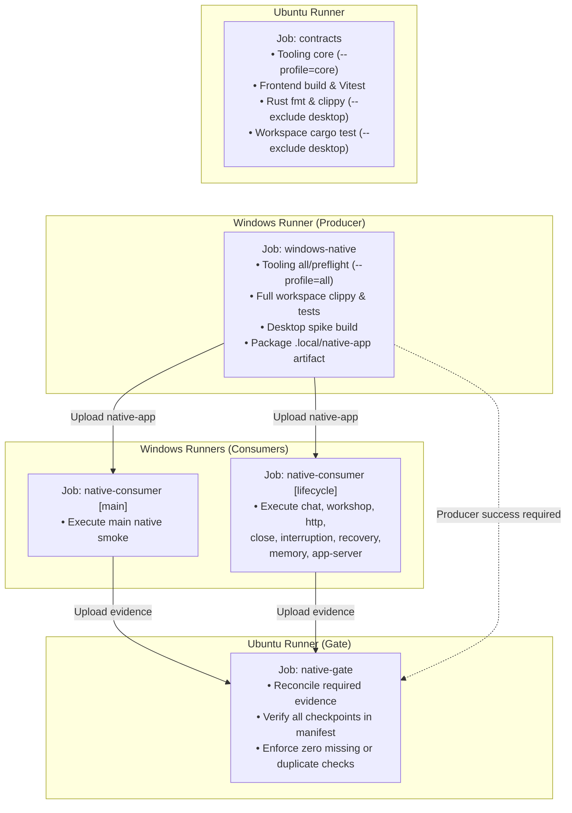

# Qualification and Acceptance Boundaries

A successful command establishes only the checks that command actually executed.

No single command or passing badge establishes universal correctness. A passing unit test does not qualify IPC serialization; passing IPC tests do not qualify native WebView2 rendering; a green local check does not qualify installed-package behavior; and synthetic mock responses do not qualify live model output.

---

## Qualification Scopes

| Scope | What It Establishes | What It Does Not Establish | Authoritative Runner / Record |
|---|---|---|---|
| **Focused Local Checks** | Target-specific logic in selected unit, integration, or frontend files. | Cross-layer invariants, unselected crates, full integration, or native behavior. | `desktop.cmd quick <crate>`, `desktop.cmd test <path>`, `cargo test -p <pkg>` |
| **Full Local Check** | Source integrity: formatting, strict workspace Clippy, all workspace unit/integration/doc tests, frontend build, Vitest suite, and native preflight. | Actual native UI execution, WebView2 remote debugging, or installer lifecycle. | `desktop.cmd check` |
| **Native Development Suites** | Verified WebView2 UI automation, IPC message passing, editor state, dialog flows, and error recovery in the built debug Tauri application. | Installed-package behavior, Windows Defender / NSIS installation, or live-provider reliability. | `desktop.cmd spike` + `desktop.cmd native`, or `scripts/native-consumer.mjs` |
| **Installed-Package Qualification** | Stable release packaging, NSIS installation lifecycle, user data isolation, and cold launch on Windows. | Unexercised update paths, offline network transitions, or unexercised native features. | `.github/workflows/package.yml` / [Package Qualification](../WINDOWS_PACKAGE_QUALIFICATION.md) |
| **Live-Provider Trial** | Exact request shape, protocol compatibility, auth handoff, and durable receipt persistence for explicitly authorized synthetic requests. | General provider uptime, latency guarantees, or creative narrative quality. | Explicit example binaries with opt-in environment flags (e.g. `qualify_codex_app_server`) |
| **Human & Accessibility Evaluation** | Specific observations defined by an author trial or evaluation protocol (e.g., 200% zoom geometry, keyboard navigation). | Properties or workflows that were not explicitly evaluated by human participants. | [Author Trial Protocols](../references/) |

---

## Hosted CI Architecture

Hosted continuous integration in [`.github/workflows/ci.yml`](../../.github/workflows/ci.yml) validates candidate revisions across two environments (Ubuntu and Windows).

### 1. Default Topology: Fan-Out (`native_layout=fanout`)
- **`contracts` (Ubuntu)**: Executes quickly to provide early feedback. Validates package version consistency, core tooling tests, frontend production build, full Vitest suite, Rust formatting, and non-desktop Rust crates.
- **`windows-native` (Windows Producer)**: Runs tooling preflight, full workspace compilation and tests (including `webnovel-desktop`), builds the native application (`desktop:spike`), and packages a deterministic native executable bundle under `.local/native-app/`.
- **`native-consumer` (Windows Matrix)**: Runs parallel consumer jobs across `main` and `lifecycle` partitions without recompiling. Each consumer downloads the verified native bundle and executes its designated suites using `scripts/native-consumer.mjs`.
- **`native-gate` (Ubuntu)**: A fail-closed gate that requires success from the producer and all consumers. It downloads all generated evidence manifests and verifies that every checkpoint declared in `scripts/native-suites.json` was executed exactly once with zero unexpected or duplicate entries.

### 2. Serial Alternative (`native_layout=serial`)
Available via `workflow_dispatch` for direct comparison:
- The `windows-native` producer compiles the application, runs all native suites sequentially on a single runner, and reconciles evidence locally without spawning consumer jobs.

---

## Native Suite Authority: `scripts/native-suites.json`

The suite manifest at [`scripts/native-suites.json`](../../scripts/native-suites.json) is the **sole authoritative source** for:
1. Suite definitions and target script locations.
2. Partition topology (`parallel` consumers vs `serial` execution).
3. Checkpoint ID inventory (e.g. `native-smoke:01` through `native-smoke:36`, `native-chat-smoke:01` through `native-chat-smoke:21`, etc.).

Prose documents must not maintain parallel checkpoint lists that can drift from this manifest. A native run passes only when `scripts/native-consumer.mjs aggregate` confirms that every check registered in `scripts/native-suites.json` has a corresponding passing checkpoint in the evidence report.

---

## Distinguishing Rerun and Retest Modes

Do not conflate rerunning a workflow, retesting an installer, and reusing a local build artifact:

1. **GitHub Job Rerun**:
   - Triggers re-execution of existing workflow jobs on GitHub Actions.
   - Retains the original event's `GITHUB_SHA` and `GITHUB_REF`.
   - Used to retry infrastructure flakes, not to test new code.

2. **Installer Harness Retest** (`scripts/prepare-package-retest.mjs`):
   - Tests an existing, signed NSIS installer against a newer qualification harness.
   - Permitted only when changes are strictly confined to test fixtures or documentation.
   - Fail-closed: refuses any modifications to application source code or build configuration.

3. **Native Executable Artifact Reuse** (`scripts/native-artifact.mjs`):
   - Bundles the compiled desktop executable and its assets into `.local/native-app/`.
   - Used by CI consumers and local scripts to run multiple test suites against an identical binary without repeated `cargo build` invocations.

---

## Advisory Planning vs Mechanical Gates

- **Advisory (Planner)**:
  `scripts/test-plan.mjs` (invoked via `desktop.cmd plan`) analyzes working-tree or revision-range diffs and suggests an optimal test command. It provides advice on which suites to run to minimize iteration time. **Its recommendations do not constitute proof of passing, and its exclusions do not waive CI gate requirements.**
- **Mechanical Gates**:
  - `desktop.cmd check`: Local script gate requiring zero linter warnings, clean formatting, and 100% passing tests.
  - `featureBoundary.test.ts`: AST-based import scanner that strictly rejects production-to-test code imports.
  - `native-gate`: CI workflow step that parses all uploaded evidence JSON files and fails if any required checkpoint is missing or duplicated.
